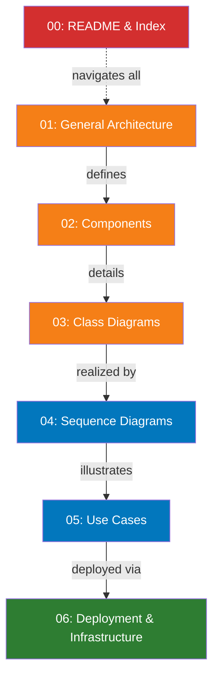

# UML Diagrams Summary & Quick Reference

> **Quick visual guide** to all UML diagrams generated for the Wine Fermentation Monitoring System.

## 📊 What We've Generated



---

## 🎯 Finding Specific Information

### If you want to understand...

**"How does the system work?"**
→ Start with [01-GENERAL-ARCHITECTURE.md](01-GENERAL-ARCHITECTURE.md)
- System architecture overview
- Module dependencies
- Clean architecture layers

**"What are the components of [Module]?"**
→ Read [02-COMPONENTS.md](02-COMPONENTS.md)
- Fermentation Module components (Domain, Service, Repository, API)
- Analysis Engine components
- Fruit Origin Module components
- Auth Module components

**"What classes/entities do we have?"**
→ Check [03-CLASS-DIAGRAMS.md](03-CLASS-DIAGRAMS.md)
- Class hierarchies per module
- Entity relationships
- Interface contracts
- Service dependencies

**"How does [Workflow] work step-by-step?"**
→ Look at [04-SEQUENCE-DIAGRAMS.md](04-SEQUENCE-DIAGRAMS.md)
- Create Fermentation (with validation)
- Record Sample (with multi-level checks)
- Run Analysis (with anomaly detection)
- User Login (with JWT tokens)
- Historical Comparison
- Multi-winery isolation
- Soft delete recovery

**"What can users do?"**
→ Review [05-USE-CASES.md](05-USE-CASES.md)
- UC-001 to UC-012 (main use cases)
- Fermentation management
- Analysis & recommendations
- Historical insights
- Error handling

**"How do we deploy this?"**
→ Study [06-DEPLOYMENT-INFRASTRUCTURE.md](06-DEPLOYMENT-INFRASTRUCTURE.md)
- Cloud deployment (AWS/Azure/DigitalOcean)
- On-premise deployment
- Database schema
- Data flow architecture
- Docker Compose infrastructure
- CI/CD pipeline

---

## 📍 Diagram Locations & Statistics

| File | Diagrams | Size | Updated |
|------|----------|------|---------|
| 01-GENERAL-ARCHITECTURE.md | 4 | 3.2 KB | Feb 6, 2026 |
| 02-COMPONENTS.md | 4 | 5.1 KB | Feb 6, 2026 |
| 03-CLASS-DIAGRAMS.md | 4 | 8.3 KB | Feb 6, 2026 |
| 04-SEQUENCE-DIAGRAMS.md | 7 | 9.8 KB | Feb 6, 2026 |
| 05-USE-CASES.md | 5 | 6.2 KB | Feb 6, 2026 |
| 06-DEPLOYMENT-INFRASTRUCTURE.md | 6 | 7.4 KB | Feb 6, 2026 |
| README.md | - | 4.1 KB | Feb 6, 2026 |
| **TOTAL** | **30+** | **44.1 KB** | - |

---

## 🗂️ Coverage Matrix

### By Module

```
┌─────────────────────┬──────┬───────────┬──────┬─────┐
│ Module              │ Gen  │ Components│ Class│ Seq │ Use │
├─────────────────────┼──────┼───────────┼──────┼─────┤
│ Fermentation        │ ✅   │ ✅        │ ✅   │ ✅  │ ✅  │
│ Analysis Engine     │ ✅   │ ✅        │ ✅   │ ✅  │ ✅  │
│ Fruit Origin        │ ✅   │ ✅        │ ✅   │ -   │ ✅  │
│ Authentication      │ ✅   │ ✅        │ ✅   │ ✅  │ ✅  │
│ Winery              │ ✅   │ -         │ -    │ -   │ -   │
│ Shared Infrastructure│ ✅   │ -         │ -    │ ✅  │ -   │
│ Deployment          │ -    │ -         │ -    │ -   │ -   │ → 06
└─────────────────────┴──────┴───────────┴──────┴─────┴─────┘
```

### By Diagram Type

```
Graph Type              Count   Examples
─────────────────────────────────────────────────────────
System Architecture     4       System overview, Module deps, Clean layers, Multi-tenancy
Components              4       Fermentation, Analysis, Fruit, Auth
Class/Entity            4       Entities, Services, Repositories, DTOs
Sequence               7        Create, Sample, Analysis, Login, Historical, Isolation, Delete
Use Cases              5        Management, Analysis, Historical, Error, Benefits
Deployment             6        Cloud, On-Premise, DB Schema, Data Flow, Docker, CI/CD
─────────────────────────────────────────────────────────
TOTAL                 30+
```

---

## 🔍 Quick Lookup Guide

### Architecture & Design
- **System layers**: [01-GENERAL-ARCHITECTURE.md#clean-architecture-layers](01-GENERAL-ARCHITECTURE.md#clean-architecture-layers)
- **Module dependencies**: [01-GENERAL-ARCHITECTURE.md#module-dependencies](01-GENERAL-ARCHITECTURE.md#module-dependencies)
- **Multi-tenancy**: [01-GENERAL-ARCHITECTURE.md#multi-tenancy-architecture](01-GENERAL-ARCHITECTURE.md#multi-tenancy-architecture)

### Fermentation Management
- **Entities**: [03-CLASS-DIAGRAMS.md#fermentation-module---class-diagram](03-CLASS-DIAGRAMS.md#fermentation-module---class-diagram)
- **Components**: [02-COMPONENTS.md#fermentation-module-components](02-COMPONENTS.md#fermentation-module-components)
- **Create workflow**: [04-SEQUENCE-DIAGRAMS.md#create-fermentation-sequence](04-SEQUENCE-DIAGRAMS.md#create-fermentation-sequence)
- **Add sample workflow**: [04-SEQUENCE-DIAGRAMS.md#add-sample-to-fermentation-sequence](04-SEQUENCE-DIAGRAMS.md#add-sample-to-fermentation-sequence)

### Analysis Engine
- **Entities**: [03-CLASS-DIAGRAMS.md#analysis-engine---class-diagram](03-CLASS-DIAGRAMS.md#analysis-engine---class-diagram)
- **Components**: [02-COMPONENTS.md#analysis-engine-components](02-COMPONENTS.md#analysis-engine-components)
- **Analysis workflow**: [04-SEQUENCE-DIAGRAMS.md#fermentation-analysis-sequence](04-SEQUENCE-DIAGRAMS.md#fermentation-analysis-sequence)
- **Use cases**: [05-USE-CASES.md#analysis--recommendation-use-cases](05-USE-CASES.md#analysis--recommendation-use-cases)

### Authentication & Security
- **User entities**: [03-CLASS-DIAGRAMS.md#authentication-module---class-diagram](03-CLASS-DIAGRAMS.md#authentication-module---class-diagram)
- **Login workflow**: [04-SEQUENCE-DIAGRAMS.md#user-login-sequence](04-SEQUENCE-DIAGRAMS.md#user-login-sequence)
- **Multi-tenancy isolation**: [04-SEQUENCE-DIAGRAMS.md#multi-winery-data-isolation-sequence](04-SEQUENCE-DIAGRAMS.md#multi-winery-data-isolation-sequence)

### Data Management
- **Database schema**: [06-DEPLOYMENT-INFRASTRUCTURE.md#database-schema-architecture](06-DEPLOYMENT-INFRASTRUCTURE.md#database-schema-architecture)
- **Data flow**: [06-DEPLOYMENT-INFRASTRUCTURE.md#data-flow-end-to-end](06-DEPLOYMENT-INFRASTRUCTURE.md#data-flow-end-to-end)
- **Soft delete**: [04-SEQUENCE-DIAGRAMS.md#soft-delete-sequence](04-SEQUENCE-DIAGRAMS.md#soft-delete-sequence)

### Deployment
- **Cloud architecture**: [06-DEPLOYMENT-INFRASTRUCTURE.md#deployment-architecture](06-DEPLOYMENT-INFRASTRUCTURE.md#deployment-architecture)
- **On-premise**: [06-DEPLOYMENT-INFRASTRUCTURE.md#data-center--on-premise-deployment](06-DEPLOYMENT-INFRASTRUCTURE.md#data-center--on-premise-deployment)
- **CI/CD**: [06-DEPLOYMENT-INFRASTRUCTURE.md#cicd-pipeline](06-DEPLOYMENT-INFRASTRUCTURE.md#cicd-pipeline)

---

## 📚 How to Use These Diagrams

### For Developers
1. **Onboarding**: Start with [01-GENERAL-ARCHITECTURE.md](01-GENERAL-ARCHITECTURE.md) to understand the big picture
2. **Working on module**: Check [02-COMPONENTS.md](02-COMPONENTS.md) and [03-CLASS-DIAGRAMS.md](03-CLASS-DIAGRAMS.md)
3. **Implementing feature**: Review [04-SEQUENCE-DIAGRAMS.md](04-SEQUENCE-DIAGRAMS.md) for workflow
4. **Testing**: See [04-SEQUENCE-DIAGRAMS.md](04-SEQUENCE-DIAGRAMS.md) for interaction points

### For Architects
1. **System design**: [01-GENERAL-ARCHITECTURE.md](01-GENERAL-ARCHITECTURE.md) + [06-DEPLOYMENT-INFRASTRUCTURE.md](06-DEPLOYMENT-INFRASTRUCTURE.md)
2. **Module design**: [02-COMPONENTS.md](02-COMPONENTS.md) and [03-CLASS-DIAGRAMS.md](03-CLASS-DIAGRAMS.md)
3. **Scalability review**: [06-DEPLOYMENT-INFRASTRUCTURE.md](06-DEPLOYMENT-INFRASTRUCTURE.md)
4. **Integration points**: [04-SEQUENCE-DIAGRAMS.md](04-SEQUENCE-DIAGRAMS.md)

### For Product Managers
1. **Features**: [05-USE-CASES.md](05-USE-CASES.md) (what users can do)
2. **Workflows**: [04-SEQUENCE-DIAGRAMS.md](04-SEQUENCE-DIAGRAMS.md) (how things work)
3. **System capacity**: [06-DEPLOYMENT-INFRASTRUCTURE.md#infrastructure-as-code-iac---docker-compose-layout](06-DEPLOYMENT-INFRASTRUCTURE.md#infrastructure-as-code-iac---docker-compose-layout)

### For QA/Testers
1. **Use cases to test**: [05-USE-CASES.md](05-USE-CASES.md)
2. **Workflows**: [04-SEQUENCE-DIAGRAMS.md](04-SEQUENCE-DIAGRAMS.md)
3. **Error scenarios**: [05-USE-CASES.md#error-handling-scenarios](05-USE-CASES.md#error-handling-scenarios)
4. **Data isolation**: [04-SEQUENCE-DIAGRAMS.md#multi-winery-data-isolation-sequence](04-SEQUENCE-DIAGRAMS.md#multi-winery-data-isolation-sequence)

---

## ✨ Key Features Captured

### Architectural Patterns ✅
- [x] Clean Architecture (Domain, Service, Repository, API layers)
- [x] DDD (Domain-Driven Design)
- [x] Repository Pattern with interfaces
- [x] Service Layer Pattern
- [x] DTO Pattern for type safety
- [x] Multi-tenancy (Winery isolation)

### System Behaviors ✅
- [x] Fermentation CRUD with validation
- [x] Multi-level sample validation (value, chronology, business rules)
- [x] Async analysis processing
- [x] Anomaly detection (4 algorithms)
- [x] Recommendation generation (template-based)
- [x] Historical pattern comparison
- [x] User authentication with JWT

### Security & Data Protection ✅
- [x] Multi-tenancy enforcement at all layers
- [x] JWT token-based authentication
- [x] Role-based access control (RBAC)
- [x] Soft delete for data recovery
- [x] Audit trail (user tracking)
- [x] Password hashing

### Infrastructure ✅
- [x] Cloud-ready deployment (AWS/Azure)
- [x] On-premise support (Docker)
- [x] Database replication
- [x] Redis caching
- [x] Async job processing (Celery)
- [x] Monitoring (Prometheus, Grafana)
- [x] CI/CD pipeline (GitHub Actions)

---

## 🎓 Learning Path

**If you're new to this system:**

```
Day 1:
  ↓
01-GENERAL-ARCHITECTURE (System overview)
  ↓
05-USE-CASES (What can users do)
  ↓
Day 2:
  ↓
02-COMPONENTS (How modules work)
  ↓
03-CLASS-DIAGRAMS (What classes exist)
  ↓
Day 3:
  ↓
04-SEQUENCE-DIAGRAMS (How workflows execute)
  ↓
06-DEPLOYMENT-INFRASTRUCTURE (How system runs)
  ↓
You're ready to code! 🚀
```

---

## 📊 System Status at a Glance

| Component | Phase | Status | Diagrams |
|-----------|-------|--------|----------|
| **Fermentation Module** | Implementation | ✅ Complete | ✅ Full coverage |
| **Analysis Engine** | Phase 1 | ✅ Complete | ✅ Full coverage |
| **Fruit Origin Module** | Implementation | ✅ Complete | ✅ Full coverage |
| **Authentication Module** | Implementation | ✅ Complete | ✅ Full coverage |
| **Winery Module** | Implementation | ✅ Complete | ✅ Partial |
| **Deployment** | Infrastructure | ✅ Ready | ✅ Full coverage |
| **Testing** | Quality | ✅ 1,158 tests | ✅ Full coverage |

---

## 🚀 Next Steps

### To Update Diagrams When System Evolves
1. Edit the relevant Markdown file
2. Update Mermaid syntax
3. Test rendering in GitHub/IDE
4. Commit with clear message
5. Reference in ADRs if architectural change

### To Add New Diagrams
1. Create new file: `NN-TOPIC.md`
2. Add Mermaid diagrams
3. Link from README.md
4. Update this summary

---

**Total System Documentation**: 30+ Mermaid diagrams across 7 files  
**Last Generated**: February 6, 2026  
**System Stability**: Production-ready with test coverage >85%

