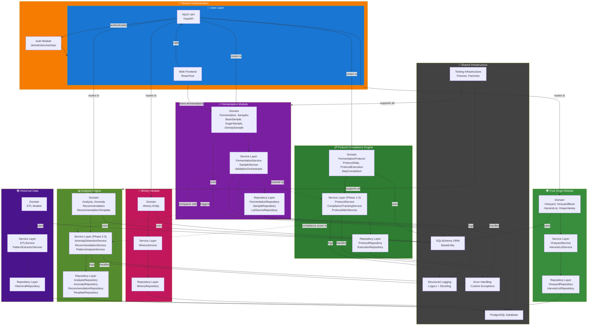
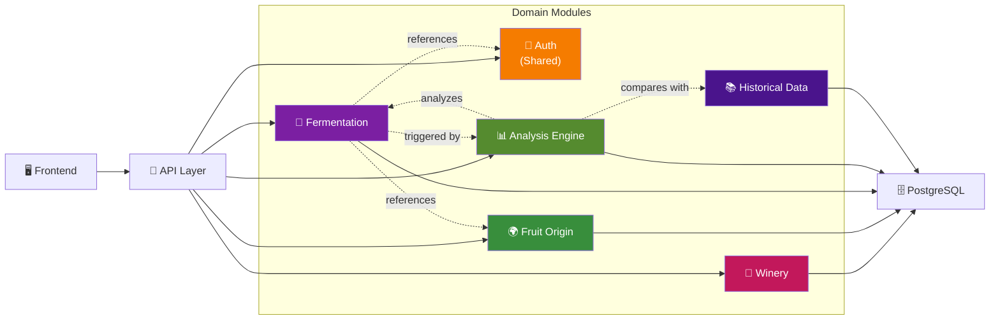
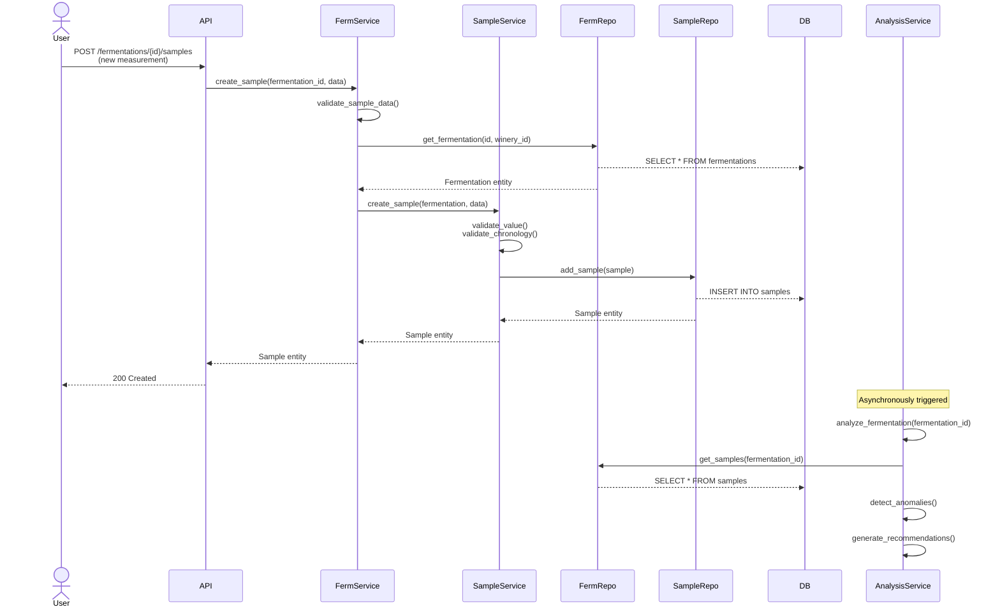
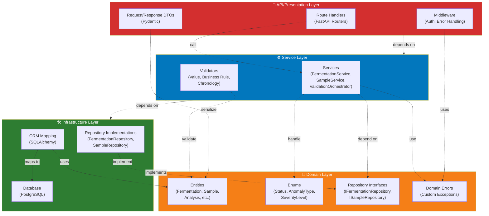
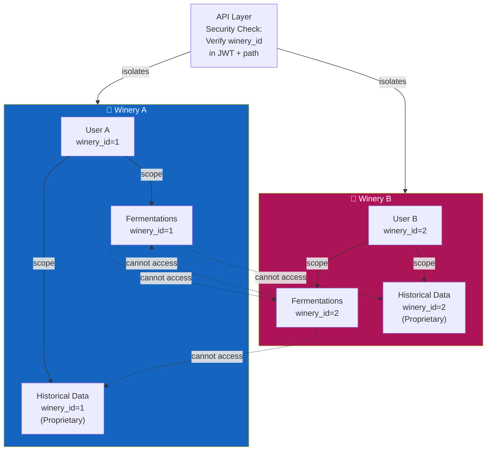

# General Architecture Diagram

> **Overview**: Complete system architecture showing all modules, their relationships, and data flow.

## System Architecture (High-Level)

---

## Module Dependencies

---

## Data Flow: New Measurement

---

## Clean Architecture Layers

---

## Multi-Tenancy Architecture

---

## Status

| Component | Status | Phase |
|-----------|--------|-------|
| **General Architecture** | ✅ Complete | - |
| **Module Integration** | ✅ Complete | - |
| **Clean Architecture** | ✅ Complete | - |
| **Multi-Tenancy** | ✅ Complete | - |

