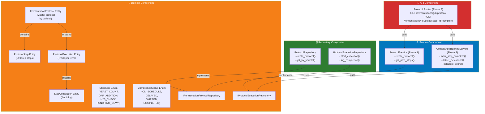
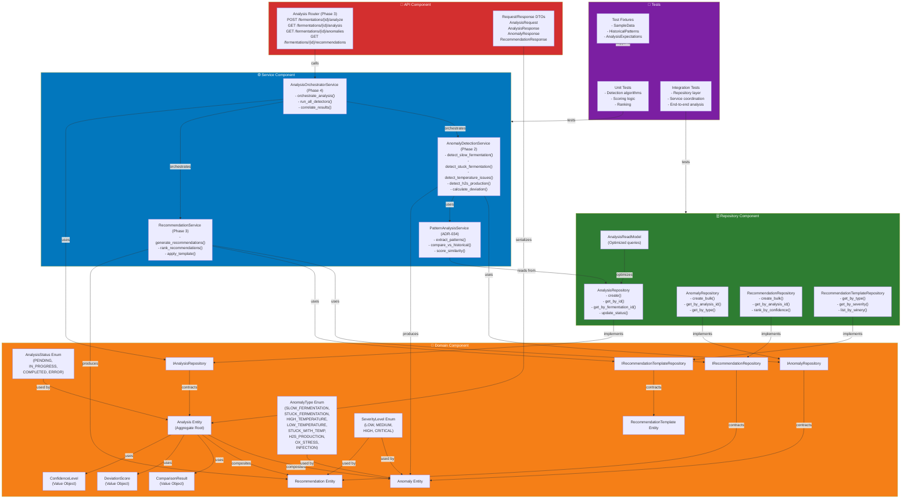
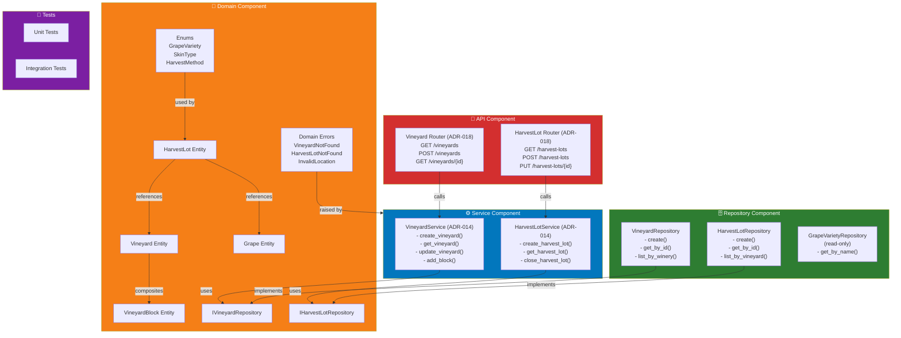
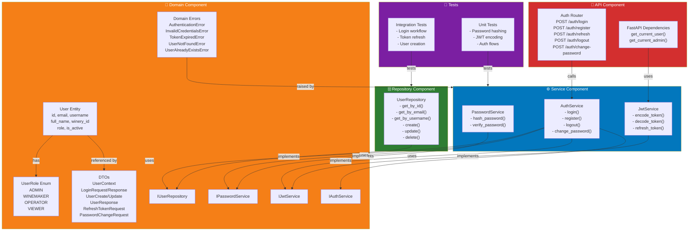

# Component Diagrams

> **Overview**: Detailed component relationships showing how different parts work together.

## Fermentation Module Components

```mermaid
graph TB
    subgraph DomainComp["🎯 Domain Component"]
        FermEntity["Fermentation Entity"]
        SampleHier["Sample Hierarchy<br/>BaseSample<br/>└─ SugarSample<br/>└─ DensitySample<br/>└─ CelsiusSample"]
        FermNoteEntity["FermentationNote Entity"]
        LotSourceEntity["FermentationLotSource Entity"]
        
        FermRepoInterface["IFermentationRepository"]
        SampleRepoInterface["ISampleRepository"]
        FermNoteRepoInterface["IFermentationNoteRepository"]
        
        SampleType["SampleType Enum<br/>(SUGAR, DENSITY, TEMP)"]
        Status["Status Enum<br/>(ACTIVE, COMPLETED,<br/>STUCK, PROBLEM)"]
        
        FermErrors["Domain Errors<br/>FermentationNotFound<br/>InvalidSample<br/>ChronologyError"]
    end
    
    subgraph RepoComp["🗄️ Repository Component"]
        FermRepo["FermentationRepository<br/>- get_by_id()<br/>- create()<br/>- update()<br/>- list_by_winery()"]
        
        SampleRepo["SampleRepository<br/>- create()<br/>- get_latest()<br/>- list_for_ferm()"]
        
        LotSourceRepo["LotSourceRepository<br/>- get_by_ferm_id()"]
        
        FermNoteRepo["FermentationNoteRepository<br/>- create()<br/>- list_for_ferm()"]
        
        BaseRepo["BaseRepository<br/>(infrastructure helper)"]
        ErrorMapper["Error Mapper<br/>DB errors →<br/>Domain errors"]
    end
    
    subgraph ServiceComp["⚙️ Service Component"]
        FermService["FermentationService<br/>- create_fermentation()<br/>- get_fermentation()<br/>- update_fermentation()<br/>- list_fermentations()"]
        
        SampleService["SampleService<br/>- create_sample()<br/>- get_latest_sample()<br/>- validate_sample()"]
        
        ValidationOrch["ValidationOrchestrator<br/>- orchestrate_validations()<br/>- value_validation()<br/>- chronology_validation()"]
        
        ValueValidator["ValueValidationService<br/>- validate_range()<br/>- check_business_rules()"]
        
        ChronoValidator["ChronologyValidationService<br/>- check_sample_order()<br/>- validate_timing()"]
        
        BizRuleValidator["BusinessRuleValidationService<br/>- check_fermentation_status()<br/>- validate_transitions()"]
    end
    
    subgraph ApiComp["🔌 API Component"]
        FermRouter["Fermentation Router<br/>GET /fermentations<br/>POST /fermentations<br/>GET /fermentations/{id}<br/>PUT /fermentations/{id}"]
        
        SampleRouter["Sample Router<br/>GET /fermentations/{id}/samples<br/>POST /fermentations/{id}/samples<br/>GET /fermentations/{id}/samples/{sample_id}"]
        
        HistoricalRouter["Historical Router (ADR-032)<br/>GET /fermentations/{id}/historical<br/>GET /fermentations/{id}/compare"]
        
        FermSchema["Request/Response DTOs<br/>FermentationCreate<br/>FermentationUpdate<br/>FermentationResponse"]
        
        SampleSchema["Request/Response DTOs<br/>SampleCreate<br/>SampleResponse"]
    end
    
    subgraph Tests["🧪 Tests"]
        UnitTests["Unit Tests<br/>- Service layer<br/>- Validators<br/>- Entities"]
        IntegrationTests["Integration Tests<br/>- Repository<br/>- Service + Repository<br/>- End-to-end"]
        Fixtures["Test Fixtures<br/>- WineryFixture<br/>- FermentationFixture<br/>- SampleFixture"]
    end
    
    %% Domain connections
    FermEntity -->|composites| SampleHier
    FermEntity -->|composites| FermNoteEntity
    FermEntity -->|references| LotSourceEntity
    
    FermRepoInterface -->|contracts| FermEntity
    SampleRepoInterface -->|contracts| SampleHier
    FermNoteRepoInterface -->|contracts| FermNoteEntity
    
    SampleType -->|used by| SampleHier
    Status -->|used by| FermEntity
    
    %% Repository connections
    FermRepo -->|implements| FermRepoInterface
    SampleRepo -->|implements| SampleRepoInterface
    LotSourceRepo -->|accesses| LotSourceEntity
    FermNoteRepo -->|implements| FermNoteRepoInterface
    
    FermRepo -->|extends| BaseRepo
    SampleRepo -->|extends| BaseRepo
    ErrorMapper -->|helps| BaseRepo
    
    %% Service connections
    FermService -->|uses| FermRepoInterface
    FermService -->|coordinates| ValidationOrch
    
    SampleService -->|uses| SampleRepoInterface
    SampleService -->|calls| ValidationOrch
    
    ValidationOrch -->|delegates to| ValueValidator
    ValidationOrch -->|delegates to| ChronoValidator
    ValidationOrch -->|delegates to| BizRuleValidator
    
    %% API connections
    FermRouter -->|calls| FermService
    SampleRouter -->|calls| SampleService
    HistoricalRouter -->|calls| FermService
    
    FermSchema -->|serializes| FermEntity
    SampleSchema -->|serializes| SampleHier
    
    %% Test connections
    UnitTests -->|tests| ServiceComp
    IntegrationTests -->|tests| RepoComp
    Fixtures -->|supports| Tests
    
    style DomainComp fill:#f57f17,color:#fff
    style RepoComp fill:#2e7d32,color:#fff
    style ServiceComp fill:#0277bd,color:#fff
    style ApiComp fill:#d32f2f,color:#fff
    style Tests fill:#7b1fa2,color:#fff
```

---

## Protocol Compliance Engine Components (ADR-021)

> ⚠️ **Status**: 📋 PROPOSED (Not yet implemented)  
> **Purpose**: Track fermentation protocol steps, detect deviations, audit compliance

### Implementation Status
| Phase | Component | Status |
|-------|-----------|--------|
| 0 | Domain Entities | 📋 Proposed |
| 1 | Repository Layer | 📋 Proposed |
| 2 | Service Layer | 📋 Proposed |
| 3 | API Layer | 📋 Proposed |

**Reference**: [ADR-021: Fermentation Protocol Compliance Engine](../../.ai-context/adr/ADR-021-protocol-compliance-engine.md)

---

## Analysis Engine Components

### Implementation Status
| Phase | Component | Status | Notes |
|-------|-----------|--------|-------|
| 1 | Domain + Repository | ✅ Implemented | 44 tests passing |
| 2-5 | Service + API | 📋 Pending | Planned for MVP Phase 2 |

> **Integration with Protocol Compliance Engine (ADR-021)**:  
> Analysis Engine can use Protocol Compliance Score as contextual factor:
> - `ComplianceScore < 80%` → Lower confidence in anomaly detection
> - `StepSkipped('H2S_CHECK')` → Flag for H₂S monitoring
> - See [Protocol Compliance Engine Components](#protocol-compliance-engine-components-adr-021) for details

**Cross-References**:
- [Protocol Compliance Engine](#protocol-compliance-engine-components-adr-021) - Integration points
- [Class Diagrams: Analysis Engine](03-CLASS-DIAGRAMS.md#2-analysis-engine-module---class-diagram) - Detailed entity structure

---

## Fruit Origin Module Components

---

## Authentication Module Components

---

## Status

| Component | Status | Phase |
|-----------|--------|-------|
| **Fermentation Module** | ✅ Complete | Domain + Service + API + Tests |
| **Protocol Compliance Engine** | 📋 Proposed | Phase 0-3 Pending (ADR-021) |
| **Analysis Engine** | 🔄 In Progress | Phase 1 Domain + Phase 2-5 Pending |
| **Fruit Origin Module** | ✅ Complete | Domain + Service + API + Tests |
| **Authentication Module** | ✅ Complete | Domain + Service + API + Tests |

