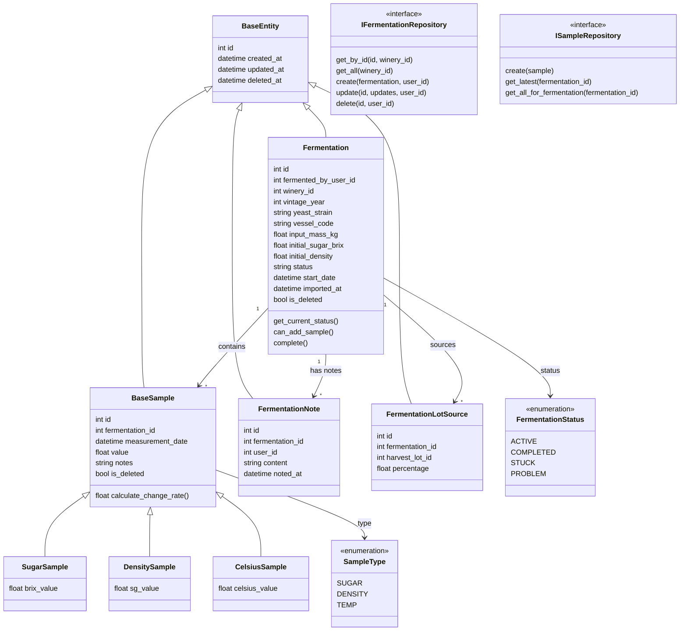
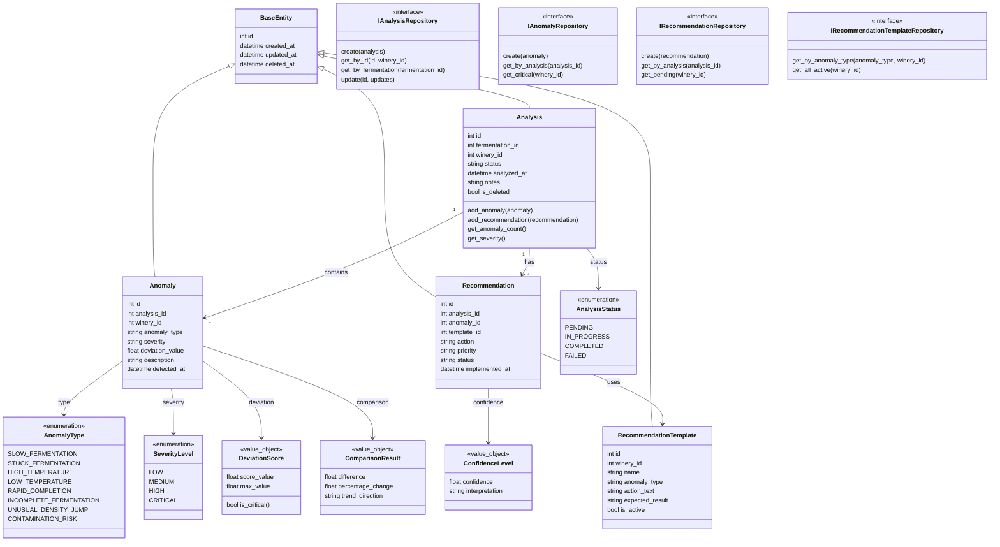
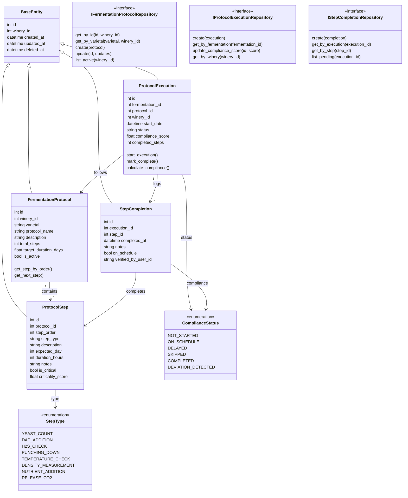
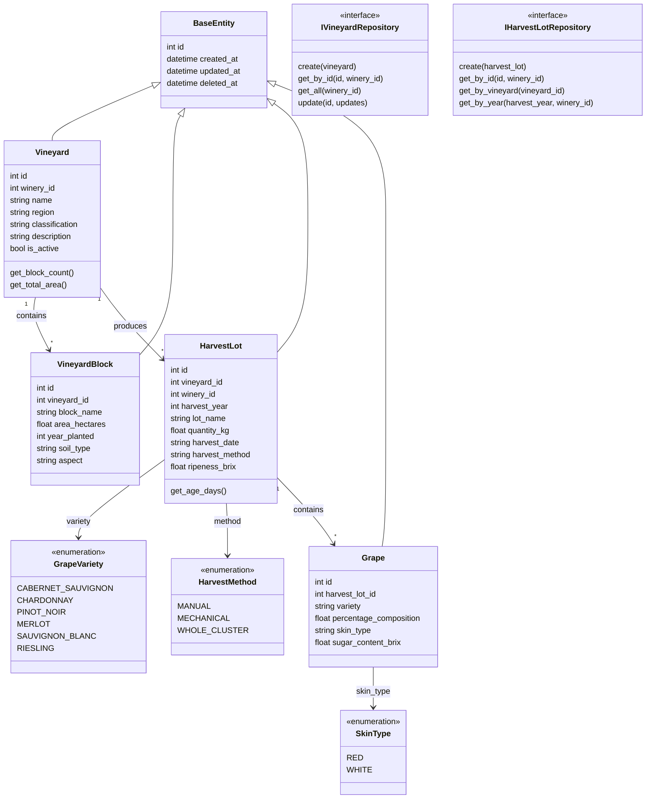
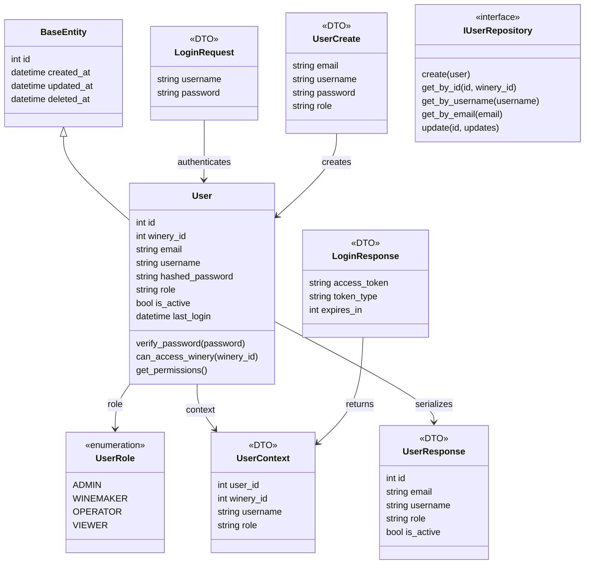
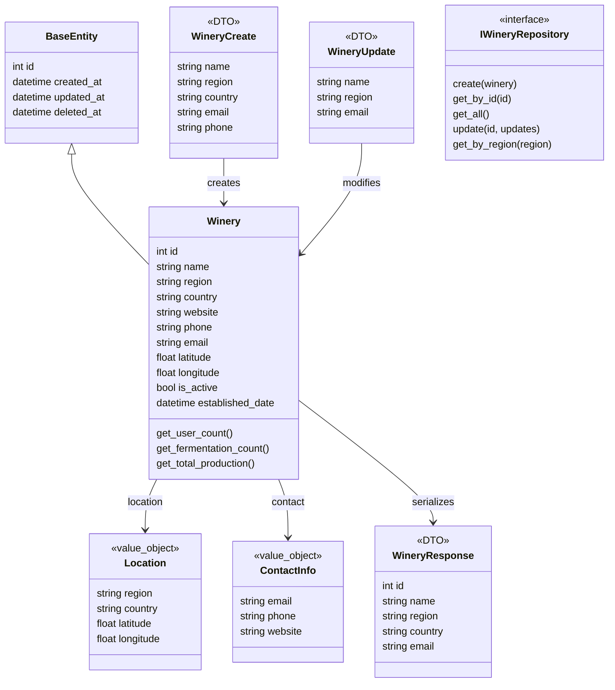
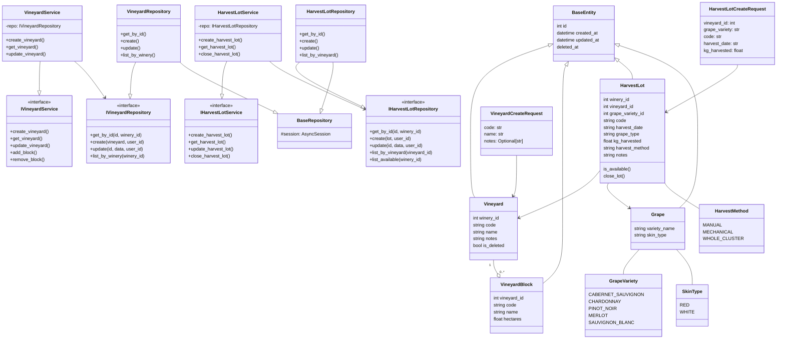

# Class Diagrams - Individual Components

> **Overview**: Class diagrams separated by module to maintain clarity and readability. Each component shows its entities, value objects, enums, and repository interfaces.

---

## 1. Fermentation Module - Class Diagram



---

## 2. Analysis Engine Module - Class Diagram



---

## 3. Protocol Compliance Engine - Class Diagram (ADR-021)

> ⚠️ **Status**: 📋 PROPOSED (Not yet implemented)



---

## 4. Fruit Origin Module - Class Diagram



---

## 4. Authentication Module - Class Diagram



---

## 5. Winery Module - Class Diagram



---

## Summary

| Component | Entities | Value Objects | Enums | Interfaces | Status |
|-----------|----------|---|-------|------------|--------|
| **Fermentation** | 6 | - | 2 | 2 | ✅ Complete |
| **Protocol Compliance** | 4 | - | 2 | 3 | 📋 Proposed |
| **Analysis Engine** | 4 | 3 | 3 | 4 | 🔄 Phase 1 Done |
| **Fruit Origin** | 4 | - | 3 | 2 | ✅ Complete |
| **Authentication** | 1 | - | 1 | 1 | ✅ Complete |
| **Winery** | 1 | 2 | - | 1 | ✅ Complete |

---

## Navigation
👈 [Back to Architecture Diagrams](README.md)
👈 [Quick Reference](00-QUICK-REFERENCE.md)
👈 [Sequence Diagrams](04-SEQUENCE-DIAGRAMS.md)

```mermaid
classDiagram
    %% ====== DOMAIN LAYER - ENTITIES ======
    class Base {
        uuid id
        int winery_id
        datetime created_at
        datetime updated_at
    }
    
    class Analysis {
        uuid id
        uuid fermentation_id
        int winery_id
        string status
        datetime analyzed_at
        dict comparison_result
        dict confidence_level
        int historical_samples_count
        start()
        complete()
        add_anomaly()
        add_recommendation()
    }
    
    class Anomaly {
        uuid id
        uuid analysis_id
        string type
        string severity
        float deviation_score
        string description
    }
    
    class Recommendation {
        uuid id
        uuid analysis_id
        string category
        string action
        float confidence
        int expected_success_rate
        string reasoning
    }
    
    class RecommendationTemplate {
        uuid id
        int winery_id
        string anomaly_type
        string severity_level
        string action
        string instructions
        int effectiveness_score
    }
    
    %% ====== VALUE OBJECTS ======
    class ComparisonResult {
        float current_value
        float expected_min
        float expected_max
        float percentile_rank
        float deviation_percentage
        is_within_range()
    }
    
    class DeviationScore {
        float z_score
        float percentile
        float sigma_value
        is_critical()
        is_warning()
    }
    
    class ConfidenceLevel {
        string level
        float score
        int sample_count
    }
    
    %% ====== DOMAIN LAYER - ENUMS & INTERFACES ======
    class AnomalyType {
        SLOW_FERMENTATION
        STUCK_FERMENTATION
        HIGH_TEMPERATURE
        LOW_TEMPERATURE
        STUCK_WITH_TEMP
        H2S_PRODUCTION
        OX_STRESS
        INFECTION
    }
    
    class SeverityLevel {
        LOW
        MEDIUM
        HIGH
        CRITICAL
    }
    
    class AnalysisStatus {
        PENDING
        IN_PROGRESS
        COMPLETED
        ERROR
    }
    
    class IAnalysisRepository {
        <<interface>>
        +create(analysis)
        +get_by_id(id)
        +get_by_fermentation_id(ferm_id)
        +update_status(id, status)
        +list_by_winery(winery_id)
    }
    
    class IAnomalyRepository {
        <<interface>>
        +create_bulk(anomalies)
        +get_by_analysis_id(analysis_id)
        +get_by_type(type)
    }
    
    class IRecommendationRepository {
        <<interface>>
        +create_bulk(recommendations)
        +get_by_analysis_id(analysis_id)
        +rank_by_confidence(analysis_id)
    }
    
    class IRecommendationTemplateRepository {
        <<interface>>
        +get_by_type_severity(type, severity)
        +list_by_winery(winery_id)
        +get_most_effective(type)
    }
    
    %% ====== SERVICE LAYER - INTERFACES ======
    class IAnomalyDetectionService {
        <<interface>>
        +detect_slow_fermentation()
        +detect_stuck_fermentation()
        +detect_temperature_issues()
        +detect_h2s_production()
        +run_all_detections()
    }
    
    class IRecommendationService {
        <<interface>>
        +generate_recommendations()
        +rank_recommendations()
        +select_best_actions()
    }
    
    class IPatternAnalysisService {
        <<interface>>
        +extract_patterns()
        +compare_vs_historical()
        +score_similarity()
    }
    
    %% ====== SERVICE LAYER - IMPLEMENTATIONS ======
    class AnomalyDetectionService {
        -anomaly_repo: IAnomalyRepository
        -pattern_service: IPatternAnalysisService
        +detect_slow_fermentation()
        +detect_stuck_fermentation()
        +run_all_detections()
    }
    
    class RecommendationService {
        -rec_repo: IRecommendationRepository
        -template_repo: IRecommendationTemplateRepository
        +generate_recommendations()
        +rank_recommendations()
    }
    
    class PatternAnalysisService {
        +extract_patterns()
        +compare_vs_historical()
    }
    
    class AnalysisOrchestratorService {
        -analysis_repo: IAnalysisRepository
        -anomaly_detector: IAnomalyDetectionService
        -rec_service: IRecommendationService
        +orchestrate_analysis()
        +run_complete_analysis()
    }
    
    %% ====== REPOSITORY LAYER ======
    class AnalysisRepository {
        +create()
        +get_by_id()
        +update_status()
    }
    
    class AnomalyRepository {
        +create_bulk()
        +get_by_analysis_id()
    }
    
    class RecommendationRepository {
        +create_bulk()
        +get_by_analysis_id()
    }
    
    class RecommendationTemplateRepository {
        +get_by_type_severity()
        +list_by_winery()
    }
    
    class BaseRepository {
        #session: AsyncSession
    }
    
    %% ====== API LAYER - SCHEMAS ======
    class AnalysisRequest {
        fermentation_id: uuid
    }
    
    class AnomalyResponse {
        type: str
        severity: str
        description: str
        deviation_score: float
    }
    
    class RecommendationResponse {
        action: str
        confidence: float
        reasoning: str
    }
    
    class AnalysisResponse {
        status: str
        anomalies: List[AnomalyResponse]
        recommendations: List[RecommendationResponse]
    }
    
    %% ====== RELATIONSHIPS ======
    Base <|-- Analysis
    Base <|-- Anomaly
    Base <|-- Recommendation
    Base <|-- RecommendationTemplate
    
    Analysis "1" --o "0..*" Anomaly
    Analysis "1" --o "0..*" Recommendation
    
    Anomaly -- AnomalyType
    Anomaly -- SeverityLevel
    Analysis -- AnalysisStatus
    Recommendation -- SeverityLevel
    
    Analysis -- ComparisonResult
    Analysis -- DeviationScore
    Analysis -- ConfidenceLevel
    
    AnalysisRepository --|> IAnalysisRepository
    AnomalyRepository --|> IAnomalyRepository
    RecommendationRepository --|> IRecommendationRepository
    RecommendationTemplateRepository --|> IRecommendationTemplateRepository
    
    AnalysisRepository --|> BaseRepository
    AnomalyRepository --|> BaseRepository
    RecommendationRepository --|> BaseRepository
    RecommendationTemplateRepository --|> BaseRepository
    
    AnomalyDetectionService --|> IAnomalyDetectionService
    RecommendationService --|> IRecommendationService
    PatternAnalysisService --|> IPatternAnalysisService
    
    AnomalyDetectionService --> IAnomalyRepository
    AnomalyDetectionService --> IPatternAnalysisService
    
    RecommendationService --> IRecommendationRepository
    RecommendationService --> IRecommendationTemplateRepository
    
    AnalysisOrchestratorService --> IAnalysisRepository
    AnalysisOrchestratorService --> IAnomalyDetectionService
    AnalysisOrchestratorService --> IRecommendationService
    
    AnalysisRequest --> Analysis
    AnomalyResponse --> Anomaly
    RecommendationResponse --> Recommendation
    AnalysisResponse --> Analysis
```



---

## Fruit Origin Module - Class Diagram



---

## Authentication Module - Class Diagram

```mermaid
classDiagram
    %% ====== DOMAIN LAYER - ENTITIES ======
    class BaseEntity {
        int id
        datetime created_at
        datetime updated_at
    }
    
    class User {
        int id
        int winery_id
        string email
        string username
        string full_name
        string hashed_password
        UserRole role
        bool is_active
        bool is_verified
        datetime last_login_at
        get_permissions()
        has_permission()
    }
    
    %% ====== DOMAIN LAYER - ENUMS & INTERFACES ======
    class UserRole {
        ADMIN
        WINEMAKER
        OPERATOR
        VIEWER
        get_permissions()
    }
    
    class UserContext {
        int user_id
        int winery_id
        string email
        UserRole role
        datetime iat
        datetime exp
    }
    
    class IUserRepository {
        <<interface>>
        +get_by_id(id)
        +get_by_email(email)
        +get_by_username(username)
        +create(user)
        +update(id, data)
        +delete(id)
    }
    
    class IPasswordService {
        <<interface>>
        +hash_password(password)
        +verify_password(password, hash)
    }
    
    class IJwtService {
        <<interface>>
        +encode_token(claims)
        +decode_token(token)
        +refresh_token(refresh_token)
    }
    
    class IAuthService {
        <<interface>>
        +login(email, password)
        +register(data)
        +logout()
        +refresh_access_token(token)
        +change_password()
        +verify_email()
    }
    
    %% ====== DTOs ======
    class LoginRequest {
        string email
        string password
    }
    
    class LoginResponse {
        string access_token
        string refresh_token
        string token_type
    }
    
    class UserCreate {
        string email
        string username
        string password
        string full_name
        int winery_id
    }
    
    class UserResponse {
        int id
        string email
        string username
        string full_name
        int winery_id
        UserRole role
        bool is_active
    }
    
    class PasswordChangeRequest {
        string old_password
        string new_password
    }
    
    %% ====== SERVICE LAYER - IMPLEMENTATIONS ======
    class PasswordService {
        -config: PasswordConfig
        +hash_password()
        +verify_password()
    }
    
    class JwtService {
        -config: JwtConfig
        +encode_token()
        +decode_token()
        +refresh_token()
    }
    
    class AuthService {
        -user_repo: IUserRepository
        -password_service: IPasswordService
        -jwt_service: IJwtService
        +login()
        +register()
        +change_password()
    }
    
    %% ====== REPOSITORY LAYER ======
    class UserRepository {
        +get_by_id()
        +get_by_email()
        +get_by_username()
        +create()
        +update()
        +delete()
    }
    
    class BaseRepository {
        #session: AsyncSession
    }
    
    %% ====== API LAYER ======
    class AuthRouter {
        +login()
        +register()
        +refresh()
        +logout()
        +change_password()
    }
    
    %% ====== RELATIONSHIPS ======
    BaseEntity <|-- User
    User -- UserRole
    User -- UserContext
    
    UserRepository --|> IUserRepository
    UserRepository --|> BaseRepository
    
    PasswordService --|> IPasswordService
    JwtService --|> IJwtService
    AuthService --|> IAuthService
    
    AuthService --> IUserRepository
    AuthService --> IPasswordService
    AuthService --> IJwtService
    
    LoginRequest --> AuthService
    LoginResponse --> JwtService
    UserCreate --> User
    UserResponse --> User
    PasswordChangeRequest --> AuthService
    


