# Sequence Diagrams

> **Overview**: Detailed workflow sequences showing interactions between components for key operations.

## Create Fermentation Sequence

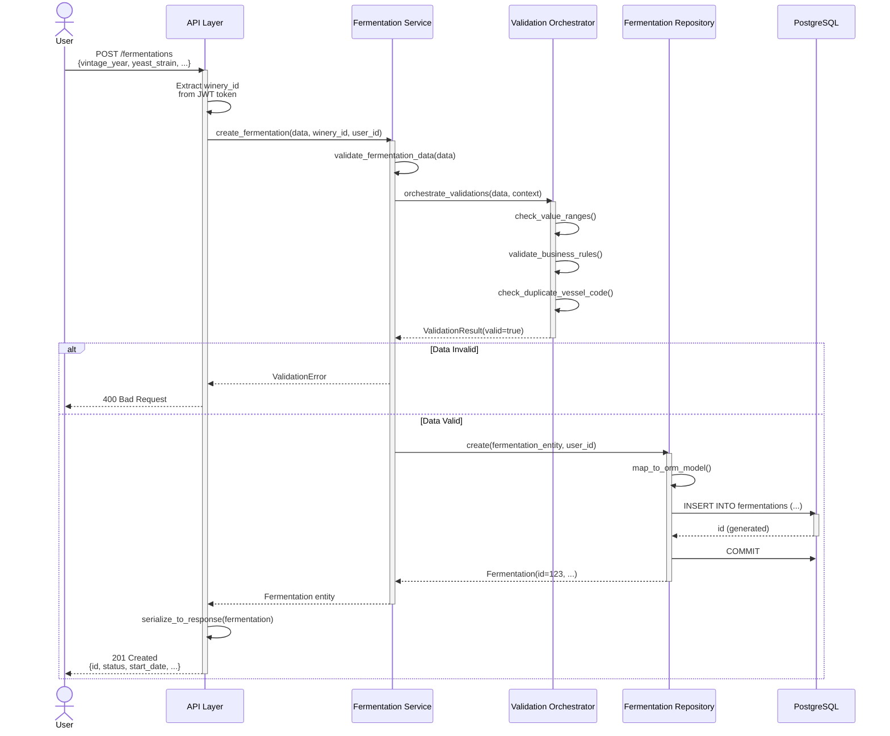

---

## Add Sample to Fermentation Sequence

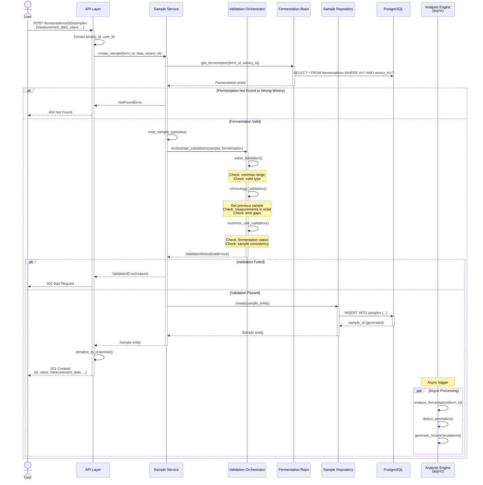

---

## Fermentation Analysis Sequence

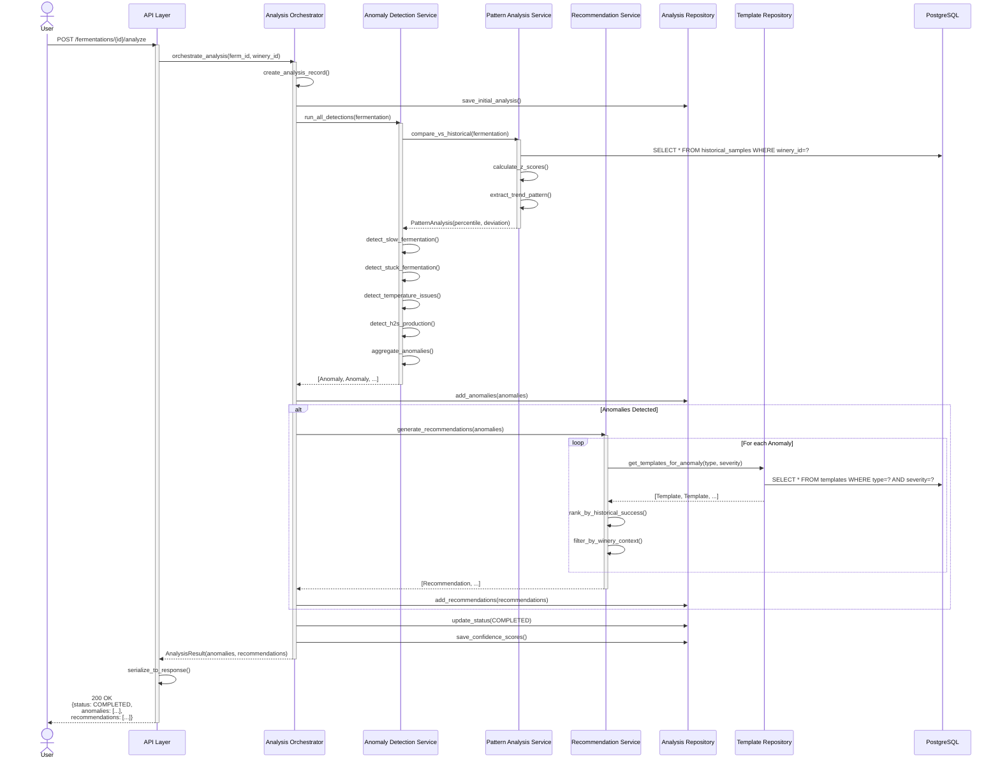

---

## User Login Sequence

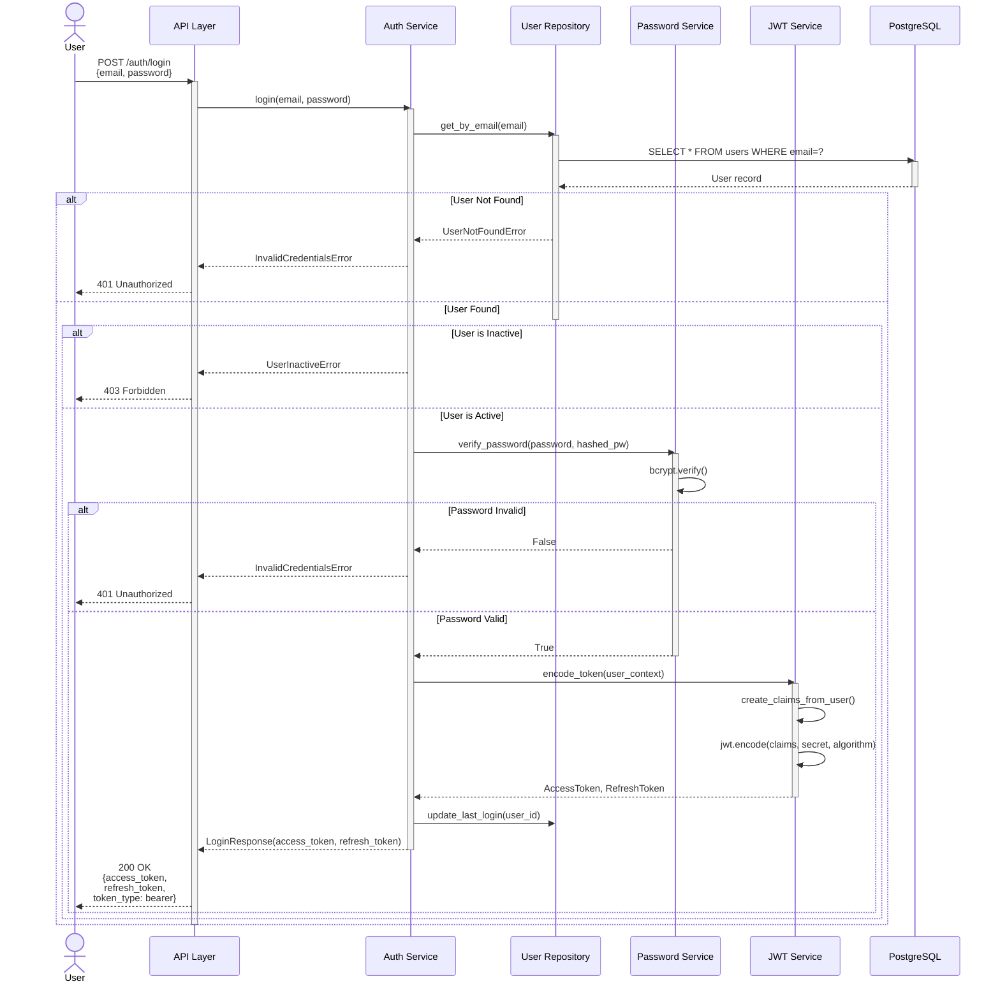

---

## Historical Data Comparison Sequence

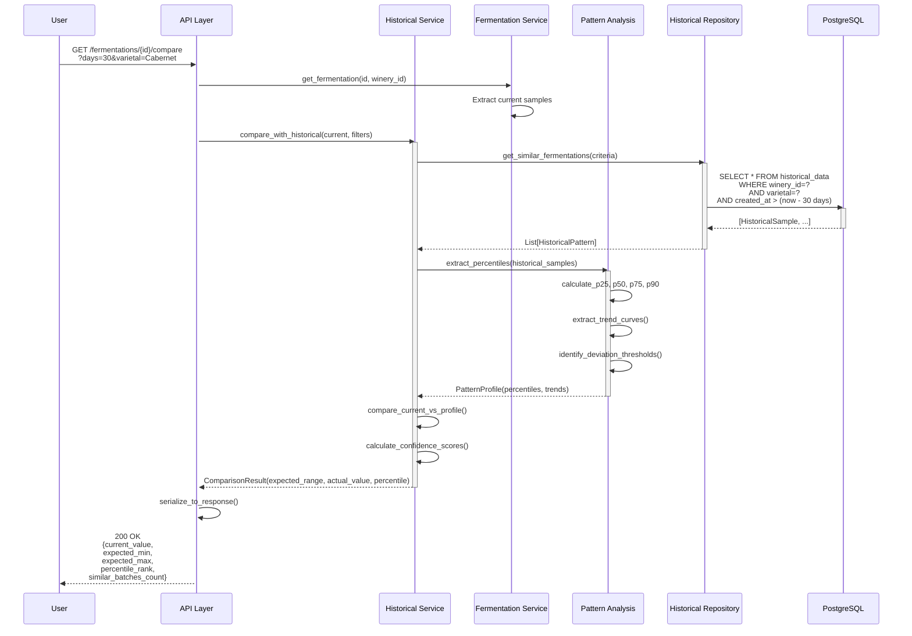

---

## Multi-Winery Data Isolation Sequence

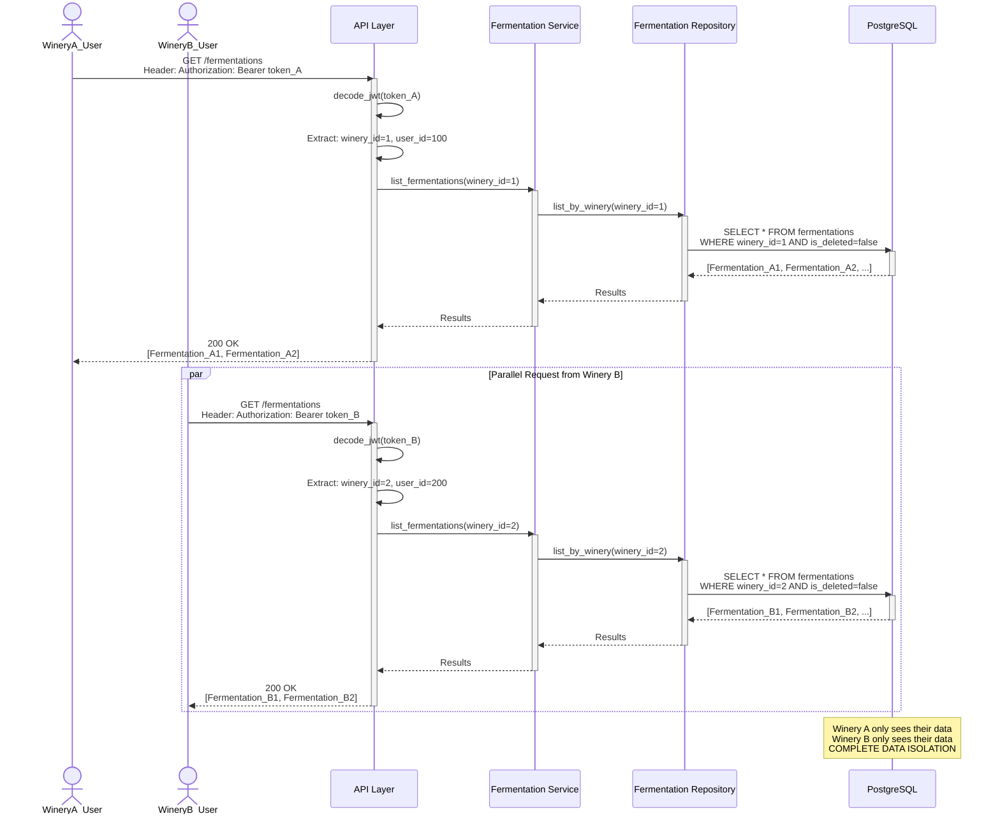

---

## Soft Delete Sequence

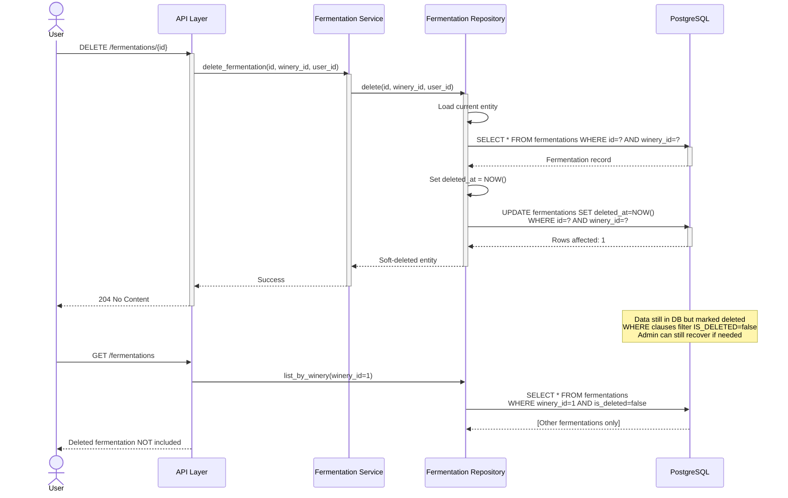

---

## Start Protocol Execution Sequence (ADR-021)

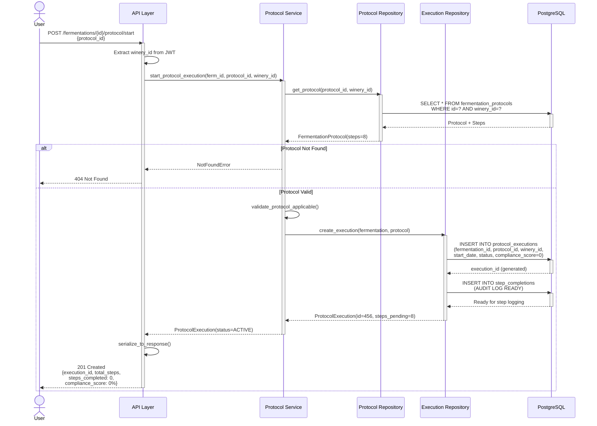

---

## Log Step Completion Sequence (ADR-021)

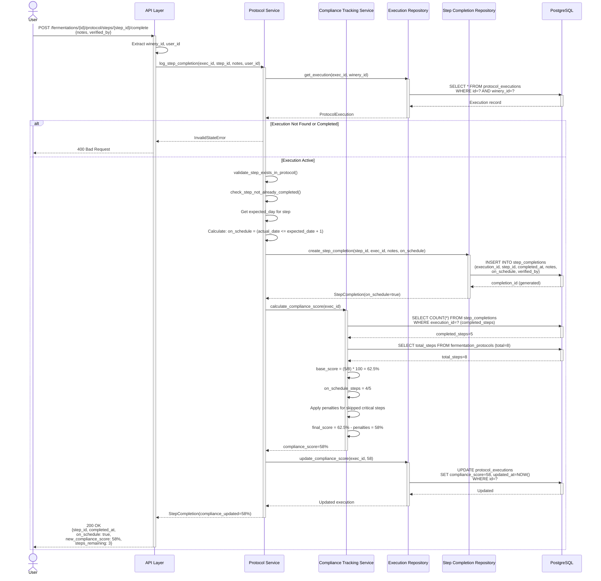

---

## Create Harvest Lot & Link to Fermentation Sequence

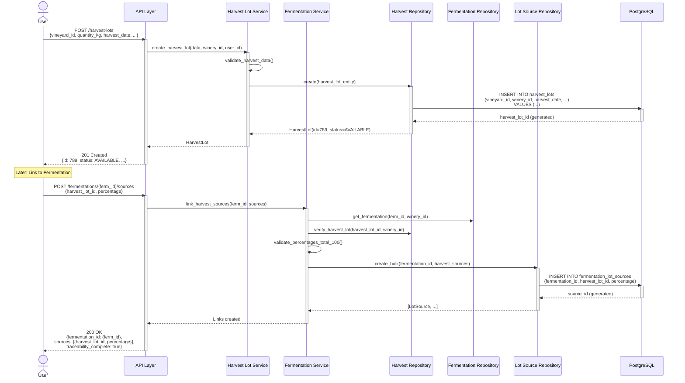

---

## Manage User Roles & Permissions Sequence

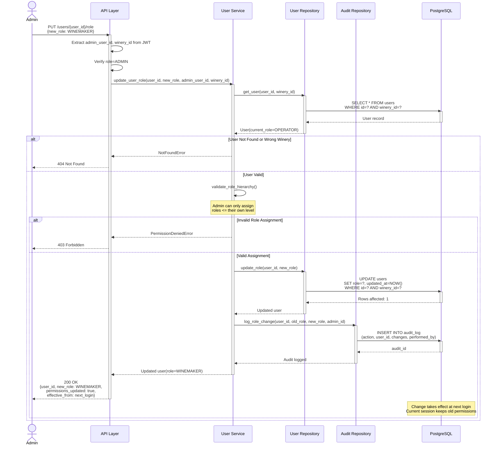

---

## Refresh Access Token Sequence

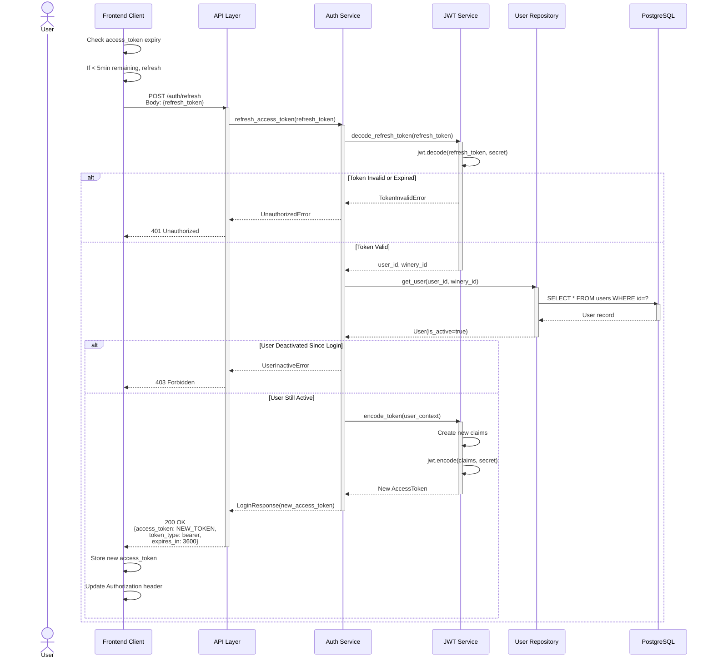

---

## Status

| Sequence | Status | Details |
|----------|--------|---------|
| **Create Fermentation** | ✅ Complete | Create + Validation + Persistence |
| **Add Sample** | ✅ Complete | Multi-level validation + Async analysis trigger |
| **Fermentation Analysis** | ✅ Complete | Anomaly detection + Recommendations |
| **User Login** | ✅ Complete | Auth + JWT token generation |
| **Historical Comparison** | ✅ Complete | Pattern extraction + Comparison |
| **Multi-Tenancy Isolation** | ✅ Complete | Winery ID scoping at all layers |
| **Soft Delete** | ✅ Complete | Logical deletion + Recovery support |
| **Start Protocol Execution** | 📋 Proposed | Protocol setup + tracking |
| **Log Step Completion** | 📋 Proposed | Step audit + Compliance scoring |
| **Create & Link Harvest** | ✅ Complete | Traceability chain |
| **Manage User Roles** | ✅ Complete | Role hierarchy + Audit logging |
| **Refresh Token** | ✅ Complete | Token renewal + Session continuity |

