# Use Case Diagrams

> **Overview**: User interactions with the system from an end-user perspective.

## Main System Use Cases

```mermaid
graph TB
    subgraph Users["👥 Actors"]
        Winemaker["🍇 Winemaker<br/>(Primary User)"]
        Admin["👨‍💼 Admin<br/>(System)"]
        System["🤖 System<br/>(Async Processes)"]
    end
    
    subgraph FermentationUC["🍇 Fermentation Management"]
        UC1["Create Fermentation"]
        UC2["Track Measurements"]
        UC3["View Fermentation Status"]
        UC4["Add Notes"]
        UC5["Complete Fermentation"]
    end
    
    subgraph AnalysisUC["📊 Analysis & Recommendations"]
        UC6["Trigger Analysis"]
        UC7["View Anomalies"]
        UC8["Get Recommendations"]
        UC9["View Confidence Scores"]
    end
    
    subgraph HistoricalUC["📚 Historical Insights"]
        UC10["Compare vs Historical"]
        UC11["View Patterns"]
        UC12["Track Interventions"]
    end
    
    subgraph ManagementUC["🏪 Vineyard & Admin"]
        UC13["Manage Vineyards"]
        UC14["Create Harvest Lots"]
        UC15["Link Harvest to Fermentation"]
    end
    
    subgraph AuthUC["🔐 Authentication"]
        UC16["Login"]
        UC17["Logout"]
        UC18["Change Password"]
    end
    
    Winemaker -->|participates| UC1
    Winemaker -->|participates| UC2
    Winemaker -->|participates| UC3
    Winemaker -->|participates| UC4
    Winemaker -->|participates| UC5
    Winemaker -->|participates| UC7
    Winemaker -->|participates| UC8
    Winemaker -->|participates| UC10
    Winemaker -->|participates| UC16
    Winemaker -->|participates| UC17
    
    Admin -->|participates| UC13
    Admin -->|participates| UC14
    Admin -->|participates| UC15
    
    System -->|triggers| UC6
    System -->|generates| UC8
    
    style Winemaker fill:#2e7d32,color:#fff
    style Admin fill:#f57c00,color:#fff
    style System fill:#7b1fa2,color:#fff
```

---

## Fermentation Management Use Cases

```mermaid
graph LR
    Winemaker["🍇 Winemaker"]
    System["🤖 System"]
    
    subgraph "Create & Track Fermentation"
        Start["Start New Fermentation<br/>(UC-001)"]
        RecordSample["Record Daily Sample<br/>(UC-002)"]
        ViewStatus["View Current Status<br/>(UC-003)"]
        AddNote["Add Notes/Observations<br/>(UC-004)"]
        Complete["Mark as Complete<br/>(UC-005)"]
    end
    
    subgraph "Validation Rules (System)"
        ValidateRange["Validate Value Range<br/>(SYS-001)"]
        ValidateChronology["Validate Sample Order<br/>(SYS-002)"]
        ValidateBusinessRules["Validate Business Rules<br/>(SYS-003)"]
        CheckFermentationStatus["Check Fermentation Status<br/>(SYS-004)"]
    end
    
    subgraph "Include Use Cases"
        TrigerAnalysis["Trigger Auto-Analysis<br/>(INCLUDE UC-006)"]
        CompareHistorical["Compare Historical<br/>(INCLUDE UC-010)"]
    end
    
    Winemaker -->|initiates| Start
    Winemaker -->|enters| RecordSample
    Winemaker -->|queries| ViewStatus
    Winemaker -->|documents| AddNote
    Winemaker -->|updates| Complete
    
    RecordSample -->|triggers| ValidateRange
    RecordSample -->|triggers| ValidateChronology
    RecordSample -->|triggers| ValidateBusinessRules
    
    ViewStatus -->|checks| CheckFermentationStatus
    
    RecordSample -->|includes| TrigerAnalysis
    ViewStatus -->|includes| CompareHistorical
    
    System -.->|performs| ValidateRange
    System -.->|performs| ValidateChronology
    System -.->|performs| TrigerAnalysis
```

---

## Analysis & Recommendation Use Cases

```mermaid
graph LR
    Winemaker["🍇 Winemaker"]
    System["🤖 System"]
    
    subgraph "Analysis Workflow"
        TriggerAnalysis["Trigger Analysis<br/>(UC-006)"]
        ViewAnomalies["View Detected Anomalies<br/>(UC-007)"]
        ViewRecommendations["Get Recommendations<br/>(UC-008)"]
        ViewConfidence["View Confidence Scores<br/>(UC-009)"]
    end
    
    subgraph "System Analysis (Automatic)"
        DetectSlow["Detect Slow Fermentation<br/>(ALGO-001)"]
        DetectStuck["Detect Stuck Fermentation<br/>(ALGO-002)"]
        DetectTemp["Detect Temperature Issues<br/>(ALGO-003)"]
        DetectH2S["Detect H2S Production<br/>(ALGO-004)"]
        ScoreConfidence["Score Confidence<br/>(ALGO-005)"]
    end
    
    subgraph "Recommendation Generation"
        LoadTemplates["Load Recommendation Templates<br/>(SYS-005)"]
        RankBySuccess["Rank by Historical Success<br/>(SYS-006)"]
        FilterByContext["Filter by Winery Context<br/>(SYS-007)"]
    end
    
    Winemaker -->|initiates| TriggerAnalysis
    Winemaker -->|queries| ViewAnomalies
    Winemaker -->|queries| ViewRecommendations
    Winemaker -->|queries| ViewConfidence
    
    TriggerAnalysis -->|triggers| DetectSlow
    TriggerAnalysis -->|triggers| DetectStuck
    TriggerAnalysis -->|triggers| DetectTemp
    TriggerAnalysis -->|triggers| DetectH2S
    TriggerAnalysis -->|triggers| ScoreConfidence
    
    ViewAnomalies -->|includes| ScoreConfidence
    ViewRecommendations -->|includes| LoadTemplates
    ViewRecommendations -->|includes| RankBySuccess
    ViewRecommendations -->|includes| FilterByContext
    
    System -.->|performs| DetectSlow
    System -.->|performs| DetectStuck
    System -.->|performs| RankBySuccess
```

---

## Historical Data & Comparison Use Cases

```mermaid
graph LR
    Winemaker["🍇 Winemaker"]
    System["🤖 System"]
    
    subgraph "Historical Use Cases"
        CompareHistorical["Compare vs Historical<br/>(UC-010)"]
        ViewPatterns["View Historical Patterns<br/>(UC-011)"]
        TrackInterventions["Track Interventions<br/>(UC-012)"]
    end
    
    subgraph "Historical Analysis"
        LoadHistorical["Load Historical Data<br/>(SYS-008)"]
        FilterByVarietal["Filter by Varietal<br/>(SYS-009)"]
        FilterByTimeframe["Filter by Timeframe<br/>(SYS-010)"]
        CalculatePercentiles["Calculate Percentiles<br/>(SYS-011)"]
        ExtractTrends["Extract Trend Curves<br/>(SYS-012)"]
    end
    
    subgraph "Comparison Output"
        ComputeDeviation["Compute Deviation Score<br/>(SYS-013)"]
        AssessStatus["Assess Current vs Expected<br/>(SYS-014)"]
        GenerateSummary["Generate Summary Report<br/>(SYS-015)"]
    end
    
    Winemaker -->|queries| CompareHistorical
    Winemaker -->|queries| ViewPatterns
    Winemaker -->|queries| TrackInterventions
    
    CompareHistorical -->|includes| LoadHistorical
    CompareHistorical -->|includes| FilterByVarietal
    CompareHistorical -->|includes| FilterByTimeframe
    CompareHistorical -->|includes| CalculatePercentiles
    
    CompareHistorical -->|triggers| ComputeDeviation
    CompareHistorical -->|triggers| AssessStatus
    CompareHistorical -->|triggers| GenerateSummary
    
    ViewPatterns -->|includes| ExtractTrends
    TrackInterventions -->|includes| LoadHistorical
    
    System -.->|performs| CalculatePercentiles
    System -.->|performs| ComputeDeviation
```

---

## Protocol Compliance Management Use Cases (ADR-021)

> ⚠️ **Status**: 📋 PROPOSED (Not yet implemented)

```mermaid
graph LR
    Winemaker["🍇 Winemaker"]
    Admin["👨‍💼 Admin"]
    System["🤖 System"]
    
    subgraph "Protocol Management"
        ManageProtocol["Manage Master Protocols<br/>(UC-013)"]
        DefineSteps["Define Protocol Steps<br/>(UC-014)"]
        SetCriticality["Set Step Criticality<br/>(UC-015)"]
    end
    
    subgraph "Protocol Execution"
        StartExecution["Start Protocol Execution<br/>(UC-016)"]
        LogCompletion["Log Step Completion<br/>(UC-017)"]
        ViewProgress["View Protocol Progress<br/>(UC-018)"]
        ViewCompliance["View Compliance Score<br/>(UC-019)"]
    end
    
    subgraph "Deviation Detection"
        DetectSkipped["Detect Skipped Steps<br/>(ALGO-006)"]
        DetectDeviation["Detect Schedule Deviation<br/>(ALGO-007)"]
        GenerateAlert["Generate Compliance Alert<br/>(SYS-016)"]
    end
    
    Admin -->|administers| ManageProtocol
    Admin -->|defines| DefineSteps
    Admin -->|configures| SetCriticality
    
    Winemaker -->|initiates| StartExecution
    Winemaker -->|documents| LogCompletion
    Winemaker -->|monitors| ViewProgress
    Winemaker -->|checks| ViewCompliance
    
    StartExecution -->|triggers| DetectSkipped
    LogCompletion -->|triggers| DetectDeviation
    LogCompletion -->|triggers| DetectSkipped
    
    DetectDeviation -->|if critical| GenerateAlert
    DetectSkipped -->|if critical| GenerateAlert
    
    System -.->|monitors| DetectSkipped
    System -.->|calculates| DetectDeviation
```

---

## Protocol Compliance Workflows

---

### UC-013: Manage Master Protocols
**Primary Actor**: Admin  
**Precondition**: Admin authenticated  
**Main Flow**:
1. Admin navigates to "Protocols" section
2. Creates new protocol for varietal (e.g., "Cabernet Sauvignon - Spring Fermentation")
3. Selects target duration (e.g., 30 days)
4. Defines total expected steps
5. System creates protocol record with ACTIVE status
6. Protocol ready for winemakers to use

---

### UC-014: Define Protocol Steps
**Primary Actor**: Admin  
**Precondition**: Master protocol created  
**Main Flow**:
1. Admin opens protocol detail page
2. Adds ordered steps (1, 2, 3, ...)
3. For each step:
   - Selects step type (YEAST_COUNT, DAP_ADDITION, H2S_CHECK, PUNCHING_DOWN, etc.)
   - Sets expected day (e.g., "Day 3")
   - Sets duration (e.g., "2 hours")
   - Adds notes/instructions
4. System persists step order and expectations
5. Protocol ready for execution

**Alternative Flows**:
- Duplicate step type → Warning, confirm intent
- Invalid day sequence → Error, must be in order

---

### UC-016: Start Protocol Execution
**Primary Actor**: Winemaker  
**Precondition**: Active fermentation started + protocol defined  
**Main Flow**:
1. Winemaker selects fermentation
2. Chooses applicable protocol by varietal
3. System loads all protocol steps
4. System calculates start_date = fermentation.start_date
5. Creates ProtocolExecution record
6. Shows "Protocol Steps Checklist" view with:
   - Step order, type, expected day
   - Checkbox for completion
   - Notes field for each step
7. Confirmation: "Protocol tracking started"

---

### UC-017: Log Step Completion
**Primary Actor**: Winemaker  
**Precondition**: Protocol execution active  
**Main Flow**:
1. Winemaker navigates to fermentation detail
2. Views protocol steps checklist
3. When completing a step (e.g., H2S_CHECK):
   - Checks the step checkbox
   - Enters notes (e.g., "No sulfur smell detected")
   - System records:
     - Step ID, completion timestamp
     - Whether on schedule (expected_day vs actual_day)
     - Notes
4. System immediately recalculates compliance score
5. Confirmation shown with updated score

**Alternative Flows**:
- Step logged but behind schedule → Warning, note recorded
- Step skipped in sequence → Warning: "This step was not completed yet"

---

### UC-018: View Protocol Progress
**Primary Actor**: Winemaker  
**Precondition**: Protocol execution started  
**Main Flow**:
1. Winemaker opens fermentation detail
2. Views "Protocol Progress" section showing:
   - Total steps: 8
   - Completed steps: 5
   - Pending steps: 3
   - Progress bar (62.5%)
   - Checklist with checkmarks for completed steps
3. Can click each step to see:
   - Completion timestamp
   - Notes
   - Whether on schedule

---

### UC-019: View Compliance Score
**Primary Actor**: Winemaker  
**Precondition**: At least one step logged  
**Main Flow**:
1. Winemaker views fermentation dashboard
2. Sees "Protocol Compliance" widget showing:
   - Current score: 85%
   - Breakdown:
     - Steps on time: 5/8
     - Critical steps completed: 2/2
     - Deviations: 1 (1 day behind on step 3)
3. Score calculation:
   - On-schedule completion = +12.5% each (8 steps)
   - Critical step weight higher
   - Schedule deviation = -5% per day late
4. Historical comparison: "Your average: 88%"

**Alternative Flows**:
- Skipped critical step → Major score penalty, alert shown

---

## Protocol & Analysis Integration

```mermaid
graph TB
    subgraph Protocol["📋 Protocol Compliance<br/>(ADR-021)"]
        P1["Compliance Score: 85%"]
        P2["Skipped Steps: H2S_CHECK"]
        P3["Schedule Deviation: +1 day"]
    end
    
    subgraph Analysis["📊 Analysis Engine<br/>(ADR-020)"]
        A1["Detect H2S Risk"]
        A2["Anomaly Confidence"]
        A3["Recommendations"]
    end
    
    subgraph Benefits["💡 Combined Value"]
        B1["Context-aware detection"]
        B2["Higher confidence in results"]
        B3["Better recommendations"]
    end
    
    P1 -->|input| A2
    P2 -->|input| A1
    P3 -->|input| B2
    
    A1 -->|flags| B1
    A2 -->|improves| B2
    A3 -->|refines| B3
    
    style Protocol fill:#2e7d32,color:#fff
    style Analysis fill:#0277bd,color:#fff
```

---

### Preconditions & Postconditions

```mermaid
graph TB
    subgraph Preconditions["✅ Preconditions"]
        PRE1["Winemaker is authenticated"]
        PRE2["Winemaker has assigned winery"]
        PRE3["Active fermentation exists"]
        PRE4["Historical data is available"]
        PRE5["Recommendation templates exist"]
    end
    
    subgraph Actions["🔄 User Actions"]
        ACTION1["UC-001: Create Fermentation"]
        ACTION2["UC-002: Record Sample"]
        ACTION3["UC-006: Trigger Analysis"]
        ACTION4["UC-010: Compare Historical"]
    end
    
    subgraph Postconditions["✅ Postconditions"]
        POST1["Fermentation record created & stored"]
        POST2["Sample validated & persisted"]
        POST3["Anomalies detected & stored"]
        POST4["Recommendations ranked & shown"]
        POST5["Confidence scores calculated"]
        POST6["Comparison results displayed"]
    end
    
    subgraph Benefits["💡 Business Value"]
        BENEFIT1["Early anomaly detection"]
        BENEFIT2["Guided interventions"]
        BENEFIT3["Improved wine quality"]
        BENEFIT4["Reduced risk & failures"]
    end
    
    Preconditions -->|enables| Actions
    Actions -->|results in| Postconditions
    Postconditions -->|delivers| Benefits
```

---

### Error Handling Scenarios

---

## Use Case Descriptions

### UC-001: Create Fermentation
**Primary Actor**: Winemaker  
**Precondition**: User authenticated and assigned to winery  
**Main Flow**:
1. Winemaker accesses "New Fermentation" form
2. Enters vintage year, yeast strain, vessel code, mass, initial Brix, initial density
3. System validates all required fields
4. System checks for duplicate vessel codes in same winery
5. System creates fermentation record with ACTIVE status
6. Confirmation shown with fermentation ID

**Alternative Flows**:
- Vessel code already exists → Error message, ask to retry
- Missing required fields → Form validation error

---

### UC-002: Record Daily Sample
**Primary Actor**: Winemaker  
**Precondition**: Active fermentation exists  
**Main Flow**:
1. Winemaker navigates to fermentation detail
2. Clicks "Record Sample"
3. Enters measurement date, sample type, value
4. System validates:
   - Value is within expected range for sample type
   - Sample timestamp is after previous sample
   - Fermentation still in ACTIVE status
5. Sample persisted
6. System triggers async analysis
7. Confirmation shown

**Alternative Flows**:
- Value out of range → Error, user corrected value
- Out-of-order sample → Warning with explanation
- Fermentation already complete → Cannot add sample

---

### UC-006: Trigger Analysis
**Primary Actor**: System (Automatic trigger)  
**Precondition**: New sample recorded OR manual analysis request  
**Main Flow**:
1. System loads fermentation + all samples
2. Loads historical pattern for same winery/varietal
3. Runs anomaly detection algorithms:
   - Detect slow fermentation (Z-score)
   - Detect stuck fermentation (flat curve)
   - Detect temperature issues
   - Detect H2S production
4. Calculates confidence for each anomaly
5. Generates recommendations from templates
6. Ranks recommendations by historical success rate
7. Stores analysis record with COMPLETED status

**Alternative Flows**:
- Insufficient historical data → Use default thresholds
- Error in algorithm → Store with ERROR status

---

## Fruit Origin & Vineyard Management Use Cases

```mermaid
graph LR
    Admin["👨‍💼 Admin"]
    Winemaker["🍇 Winemaker"]
    
    subgraph "Vineyard Management"
        CreateVineyard["Create Vineyard<br/>(UC-020)"]
        AddBlock["Add Vineyard Block<br/>(UC-021)"]
        UpdateVineyard["Update Vineyard Info<br/>(UC-022)"]
        ViewVineyards["View All Vineyards<br/>(UC-023)"]
    end
    
    subgraph "Harvest Management"
        CreateHarvestLot["Create Harvest Lot<br/>(UC-024)"]
        AddGrapeVariety["Add Grape Varieties<br/>(UC-025)"]
        CloseHarvestLot["Close Harvest Lot<br/>(UC-026)"]
        ViewHarvestLots["View Harvest Lots<br/>(UC-027)"]
    end
    
    subgraph "Fermentation Linking"
        LinkHarvestToFerm["Link Harvest to Fermentation<br/>(UC-028)"]
        TraceOrigin["Trace Grape Origin<br/>(UC-029)"]
        GenerateOriginReport["Generate Origin Report<br/>(UC-030)"]
    end
    
    Admin -->|creates| CreateVineyard
    Admin -->|manages| AddBlock
    Admin -->|updates| UpdateVineyard
    
    Winemaker -->|views| ViewVineyards
    Winemaker -->|creates| CreateHarvestLot
    Winemaker -->|logs| AddGrapeVariety
    Winemaker -->|closes| CloseHarvestLot
    Winemaker -->|views| ViewHarvestLots
    
    Winemaker -->|performs| LinkHarvestToFerm
    Winemaker -->|queries| TraceOrigin
    Winemaker -->|generates| GenerateOriginReport
```

---

### UC-020: Create Vineyard
**Primary Actor**: Admin  
**Precondition**: Admin authenticated and assigned to winery  
**Main Flow**:
1. Admin navigates to "Vineyards" section
2. Clicks "New Vineyard"
3. Enters vineyard details: Name, region, classification, description
4. System validates unique name per winery
5. Vineyard record created with is_active=true
6. Confirmation shown with vineyard ID

---

### UC-024: Create Harvest Lot
**Primary Actor**: Winemaker  
**Precondition**: Active vineyard exists + harvest completed  
**Main Flow**:
1. Winemaker navigates to "Harvest Lots"
2. Clicks "New Harvest Lot"
3. Enters: Vineyard, harvest year, lot name, quantity (kg), harvest date, method, ripeness (Brix)
4. System validates harvest date (not in future)
5. Lot created with AVAILABLE status
6. Ready for fermentation linking

---

### UC-028: Link Harvest to Fermentation
**Primary Actor**: Winemaker  
**Precondition**: Active fermentation + available harvest lot  
**Main Flow**:
1. Winemaker selects fermentation
2. Clicks "Link Harvest Sources"
3. Searches and selects harvest lot(s)
4. Enters percentage for each (must total 100%)
5. System creates FermentationLotSource records
6. Traceability chain established: Harvest → Fermentation → Analysis

---

### UC-029: Trace Grape Origin
**Primary Actor**: Winemaker  
**Precondition**: Fermentation completed with linked harvest  
**Main Flow**:
1. Winemaker opens completed fermentation
2. Clicks "Trace Origin"
3. System displays: Vineyard(s), Block(s), Harvest lot details, Grape varieties, Harvest date/method/ripeness
4. Chain of custody displayed
5. Audit trail available

---

## Authentication & Access Control Use Cases

```mermaid
graph LR
    User["👤 User"]
    System["🤖 System"]
    
    subgraph "Authentication"
        Login["User Login<br/>(UC-031)"]
        Logout["User Logout<br/>(UC-032)"]
        RefreshToken["Refresh Access Token<br/>(UC-033)"]
    end
    
    subgraph "Account Management"
        ChangePassword["Change Password<br/>(UC-034)"]
        ResetPassword["Reset Password<br/>(UC-035)"]
        ViewProfile["View User Profile<br/>(UC-036)"]
    end
    
    User -->|initiates| Login
    User -->|performs| Logout
    User -->|requests| RefreshToken
    User -->|updates| ChangePassword
    User -->|requests| ResetPassword
    User -->|accesses| ViewProfile
```

---

### UC-031: User Login
**Primary Actor**: User  
**Precondition**: User account created + email verified  
**Main Flow**:
1. User navigates to login page
2. Enters email/username + password
3. System validates credentials
4. System verifies user.is_active = true
5. System checks user's assigned winery
6. System generates JWT token with: user_id, winery_id, role, email (expires: 1 hour) + refresh token (30 days)
7. Tokens sent to frontend
8. User redirected to dashboard

**Alternative Flows**:
- Invalid credentials → "Invalid email or password"
- Account inactive → "Account disabled, contact admin"

---

### UC-034: Change Password
**Primary Actor**: User  
**Precondition**: User authenticated + logged in  
**Main Flow**:
1. User navigates to "Account Settings"
2. Clicks "Change Password"
3. Enters old password + new password (2x)
4. System verifies old password matches
5. System validates new password (strength rules)
6. Password hashed and updated
7. All other sessions invalidated
8. Confirmation: "Password changed successfully"

---

## Winery Management & Multi-Tenancy Use Cases

```mermaid
graph LR
    SuperAdmin["🔑 Super Admin"]
    WineryAdmin["👨‍💼 Winery Admin"]
    
    subgraph "Winery Setup"
        CreateWinery["Create New Winery<br/>(UC-037)"]
        ConfigureWinery["Configure Settings<br/>(UC-038)"]
        ManageUsers["Manage Winery Users<br/>(UC-039)"]
    end
    
    subgraph "Winery Management"
        UpdateInfo["Update Winery Info<br/>(UC-040)"]
        ViewStats["View Winery Statistics<br/>(UC-041)"]
        ManageRoles["Manage User Roles<br/>(UC-042)"]
        ViewDataUsage["View Data Usage<br/>(UC-043)"]
    end
    
    SuperAdmin -->|creates| CreateWinery
    SuperAdmin -->|sets up| ConfigureWinery
    
    WineryAdmin -->|manages| ManageUsers
    WineryAdmin -->|updates| UpdateInfo
    WineryAdmin -->|views| ViewStats
    WineryAdmin -->|assigns| ManageRoles
    WineryAdmin -->|monitors| ViewDataUsage
```

---

### UC-037: Create New Winery
**Primary Actor**: Super Admin  
**Precondition**: Super Admin authenticated  
**Main Flow**:
1. Super Admin navigates to "Wineries" section
2. Clicks "Create Winery"
3. Enters: Name, region, country, website, phone, email, location (lat/long)
4. System creates Winery record
5. System initializes tenant context (winery_id scoping enforced)
6. Winery ID assigned
7. Confirmation shown with setup token

---

### UC-039: Manage Winery Users
**Primary Actor**: Winery Admin  
**Precondition**: Winery Admin authenticated + assigned to winery  
**Main Flow**:
1. Winery Admin navigates to "Users" section
2. Views all users in winery (filtered by winery_id)
3. Can: Add new user, Edit existing user, Assign/change role, Deactivate user
4. System enforces role hierarchy
5. System sends invitation email
6. Changes audited

---

### UC-042: Manage User Roles
**Primary Actor**: Winery Admin  
**Precondition**: User account exists  
**Main Flow**:
1. Admin opens user detail page
2. Clicks "Edit Role"
3. Selects new role: ADMIN (full access), WINEMAKER (create/edit fermentations), OPERATOR (record samples), VIEWER (read-only)
4. System updates user.role
5. Next login: new permissions applied
6. Audit log entry created

---

| Use Case | Type | Priority | Status |
|----------|------|----------|--------|
| **UC-001** | Create Fermentation | P0 | ✅ Implemented |
| **UC-002** | Record Sample | P0 | ✅ Implemented |
| **UC-003** | View Status | P0 | ✅ Implemented |
| **UC-004** | Add Notes | P1 | ✅ Implemented |
| **UC-005** | Complete Fermentation | P1 | ✅ Implemented |
| **UC-006** | Trigger Analysis | P0 | 🔄 Phase 2 |
| **UC-007** | View Anomalies | P0 | 🔄 Phase 3 |
| **UC-008** | Get Recommendations | P0 | 🔄 Phase 3 |
| **UC-009** | View Confidence | P1 | 🔄 Phase 3 |
| **UC-010** | Compare Historical | P0 | ✅ Implemented |
| **UC-011** | View Patterns | P1 | ✅ Implemented |
| **UC-012** | Track Interventions | P2 | 📋 Proposed |
| **UC-013** | Manage Master Protocols | P0 | 📋 Proposed (ADR-021) |
| **UC-014** | Define Protocol Steps | P0 | 📋 Proposed (ADR-021) |
| **UC-015** | Set Step Criticality | P1 | 📋 Proposed (ADR-021) |
| **UC-016** | Start Protocol Execution | P0 | 📋 Proposed (ADR-021) |
| **UC-017** | Log Step Completion | P0 | 📋 Proposed (ADR-021) |
| **UC-018** | View Protocol Progress | P1 | 📋 Proposed (ADR-021) |
| **UC-019** | View Compliance Score | P1 | 📋 Proposed (ADR-021) |
| **UC-020** | Create Vineyard | P1 | ✅ Implemented |
| **UC-021** | Add Vineyard Block | P1 | ✅ Implemented |
| **UC-022** | Update Vineyard Info | P1 | ✅ Implemented |
| **UC-023** | View All Vineyards | P0 | ✅ Implemented |
| **UC-024** | Create Harvest Lot | P0 | ✅ Implemented |
| **UC-025** | Add Grape Varieties | P1 | ✅ Implemented |
| **UC-026** | Close Harvest Lot | P1 | ✅ Implemented |
| **UC-027** | View Harvest Lots | P0 | ✅ Implemented |
| **UC-028** | Link Harvest to Fermentation | P0 | ✅ Implemented |
| **UC-029** | Trace Grape Origin | P1 | ✅ Implemented |
| **UC-030** | Generate Origin Report | P2 | ✅ Implemented |
| **UC-031** | User Login | P0 | ✅ Implemented |
| **UC-032** | User Logout | P0 | ✅ Implemented |
| **UC-033** | Refresh Access Token | P0 | ✅ Implemented |
| **UC-034** | Change Password | P1 | ✅ Implemented |
| **UC-035** | Reset Password | P1 | ✅ Implemented |
| **UC-036** | View User Profile | P1 | ✅ Implemented |
| **UC-037** | Create New Winery | P0 | ✅ Implemented |
| **UC-038** | Configure Winery Settings | P1 | ✅ Implemented |
| **UC-039** | Manage Winery Users | P0 | ✅ Implemented |
| **UC-040** | Update Winery Info | P1 | ✅ Implemented |
| **UC-041** | View Winery Statistics | P1 | ✅ Implemented |
| **UC-042** | Manage User Roles | P0 | ✅ Implemented |
| **UC-043** | View Data Usage | P2 | ✅ Implemented |

