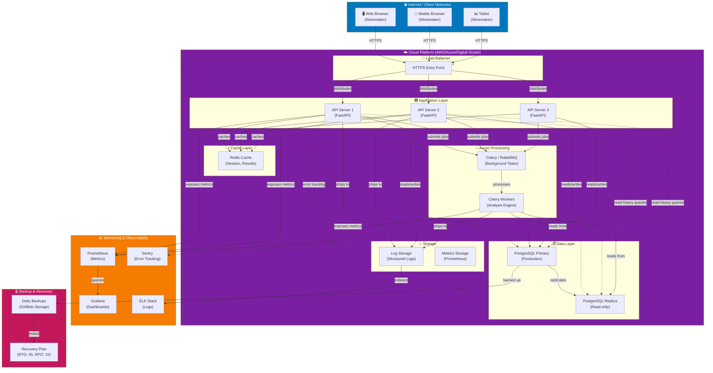
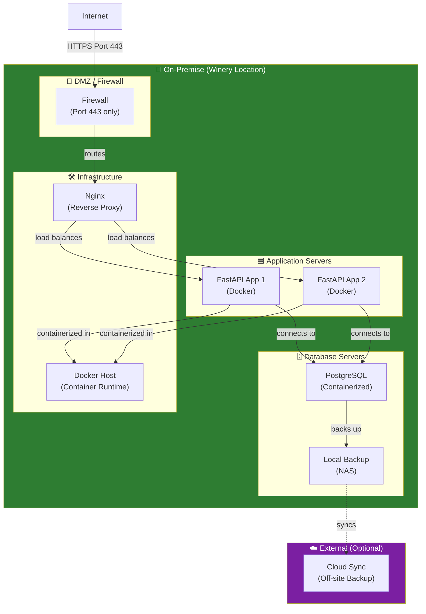
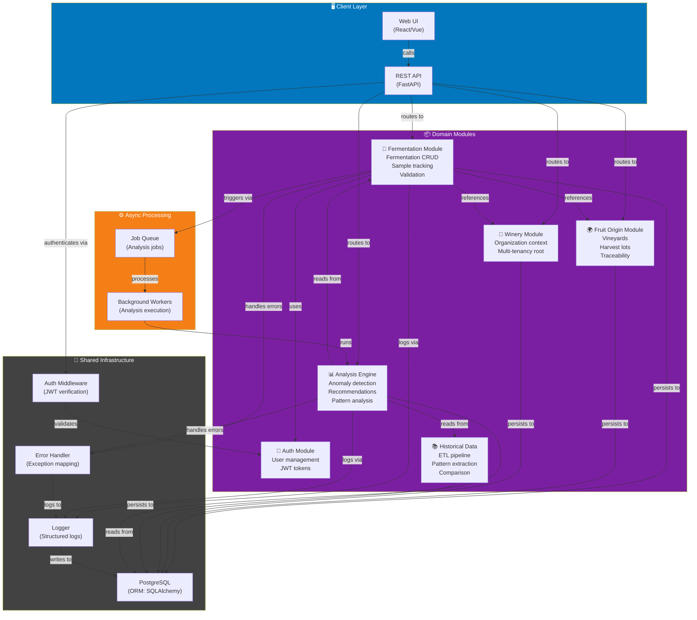
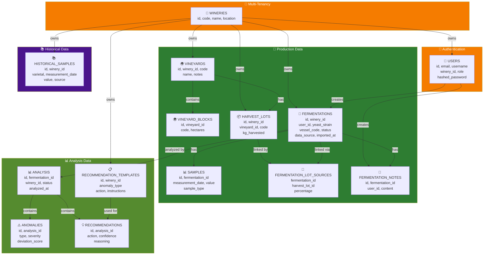
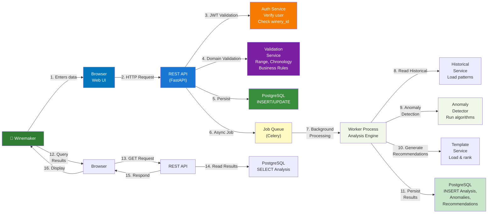
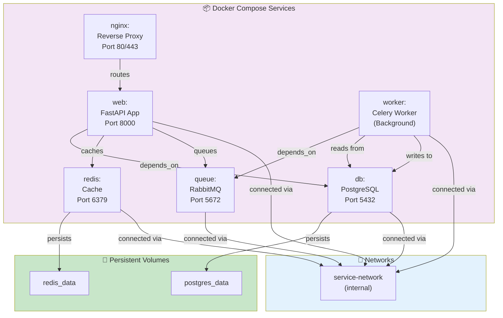
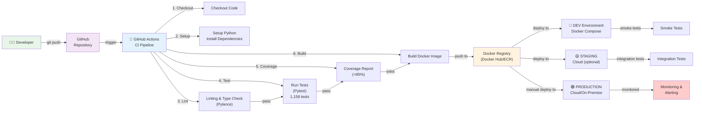

# Deployment & Infrastructure Diagrams

> **Overview**: System deployment architecture, infrastructure components, and data flow.

## Deployment Architecture

---

## Data Center / On-Premise Deployment

---

## Module Interaction & Data Flow

---

## Database Schema Architecture

---

## Data Flow: End-to-End

---

## Infrastructure as Code (IaC) - Docker Compose Layout

---

## CI/CD Pipeline

---

## Status

| Component | Status | Details |
|-----------|--------|---------|
| **Architecture** | ✅ Complete | Multi-tier, scalable design |
| **Deployment** | ✅ Cloud + On-Premise | Docker, Kubernetes-ready |
| **Database** | ✅ PostgreSQL | Multi-tenancy, soft-delete |
| **Caching** | ✅ Redis | Session + Results caching |
| **Async** | ✅ Celery + RabbitMQ | Background analysis jobs |
| **Monitoring** | ✅ Prometheus + Grafana | Metrics & Observability |
| **CI/CD** | ✅ GitHub Actions | Automated testing & deployment |
| **Backup** | ✅ Daily | RTO: 4h, RPO: 1h |

