# Deployment & Infrastructure Diagrams

> **Overview**: System deployment architecture, infrastructure components, and data flow.

## Deployment Architecture

---

## Data Center / On-Premise Deployment

---

## Module Interaction & Data Flow

```mermaid
graph TB
    subgraph Client["🖥️ Client Layer"]
        WebUI["Web UI<br/>(React/Vue)"]
        API["REST API<br/>(FastAPI)"]
    end
    
    subgraph Modules["📦 Domain Modules"]
        Auth["🔐 Auth Module<br/>User management<br/>JWT tokens"]
        
        Winery["🏪 Winery Module<br/>Organization context<br/>Multi-tenancy root"]
        
        FruitOrigin["🌍 Fruit Origin Module<br/>Vineyards<br/>Harvest lots<br/>Traceability"]
        
        Fermentation["🍇 Fermentation Module<br/>Fermentation CRUD<br/>Sample tracking<br/>Validation"]
        
        Analysis["📊 Analysis Engine<br/>Anomaly detection<br/>Recommendations<br/>Pattern analysis"]
        
        Historical["📚 Historical Data<br/>ETL pipeline<br/>Pattern extraction<br/>Comparison"]
    end
    
    subgraph Shared["🔗 Shared Infrastructure"]
        AuthMiddleware["Auth Middleware<br/>(JWT verification)"]
        ErrorHandler["Error Handler<br/>(Exception mapping)"]
        Logger["Logger<br/>(Structured logs)"]
        DB["PostgreSQL<br/>(ORM: SQLAlchemy)"]
    end
    
    subgraph Async["⚙️ Async Processing"]
        Queue["Job Queue<br/>(Analysis jobs)"]
        Workers["Background Workers<br/>(Analysis execution)"]
    end
    
    WebUI -->|calls| API
    
    API -->|authenticates via| AuthMiddleware
    AuthMiddleware -->|validates| Auth
    
    API -->|routes to| Fermentation
    API -->|routes to| Analysis
    API -->|routes to| FruitOrigin
    API -->|routes to| Winery
    
    Fermentation -->|uses| Auth
    Fermentation -->|references| FruitOrigin
    Fermentation -->|references| Winery
    Fermentation -->|persists to| DB
    
    FruitOrigin -->|persists to| DB
    Winery -->|persists to| DB
    
    Fermentation -->|triggers via| Queue
    Queue -->|processes| Workers
    
    Workers -->|runs| Analysis
    Analysis -->|reads from| Historical
    Analysis -->|reads from| Fermentation
    Analysis -->|persists to| DB
    
    Historical -->|reads from| DB
    
    Fermentation -->|logs via| Logger
    Analysis -->|logs via| Logger
    
    Fermentation -->|handles errors| ErrorHandler
    Analysis -->|handles errors| ErrorHandler
    
    Logger -->|writes to| DB
    ErrorHandler -->|logs to| Logger
    
    style Client fill:#0277bd,color:#fff
    style Modules fill:#7b1fa2,color:#fff
    style Shared fill:#424242,color:#fff
    style Async fill:#f57f17,color:#fff
```

---

## Database Schema Architecture

```mermaid
graph TB
    subgraph Tenancy["🔐 Multi-Tenancy"]
        Wineries["🏪 WINERIES<br/>id, code, name, location"]
    end
    
    subgraph Auth["🔐 Authentication"]
        Users["👤 USERS<br/>id, email, username<br/>winery_id, role<br/>hashed_password"]
    end
    
    subgraph Production["🍇 Production Data"]
        Vineyards["🌍 VINEYARDS<br/>id, winery_id, code<br/>name, notes"]
        
        VineyardBlocks["🌍 VINEYARD_BLOCKS<br/>id, vineyard_id<br/>code, hectares"]
        
        HarvestLots["📦 HARVEST_LOTS<br/>id, winery_id<br/>vineyard_id, code<br/>kg_harvested"]
        
        Fermentations["🍇 FERMENTATIONS<br/>id, winery_id<br/>user_id, yeast_strain<br/>vessel_code, status<br/>data_source, imported_at"]
        
        Samples["📊 SAMPLES<br/>id, fermentation_id<br/>measurement_date, value<br/>sample_type"]
        
        FermentationLotSources["🔗 FERMENTATION_LOT_SOURCES<br/>fermentation_id<br/>harvest_lot_id<br/>percentage"]
        
        FermentationNotes["📝 FERMENTATION_NOTES<br/>id, fermentation_id<br/>user_id, content"]
    end
    
    subgraph Analysis["📊 Analysis Data"]
        Analyses["📊 ANALYSIS<br/>id, fermentation_id<br/>winery_id, status<br/>analyzed_at"]
        
        Anomalies["⚠️ ANOMALIES<br/>id, analysis_id<br/>type, severity<br/>deviation_score"]
        
        Recommendations["💡 RECOMMENDATIONS<br/>id, analysis_id<br/>action, confidence<br/>reasoning"]
        
        RecommendationTemplates["📋 RECOMMENDATION_TEMPLATES<br/>id, winery_id<br/>anomaly_type<br/>action, instructions"]
    end
    
    subgraph Historical["📚 Historical Data"]
        HistoricalSamples["📚 HISTORICAL_SAMPLES<br/>id, winery_id<br/>varietal, measurement_date<br/>value, source"]
    end
    
    %% Relationships
    Wineries -->|owns| Users
    Wineries -->|owns| Vineyards
    Wineries -->|owns| HarvestLots
    Wineries -->|owns| Fermentations
    Wineries -->|owns| RecommendationTemplates
    Wineries -->|owns| HistoricalSamples
    
    Users -->|creates| Fermentations
    Users -->|creates| FermentationNotes
    
    Vineyards -->|contains| VineyardBlocks
    Vineyards -->|has| HarvestLots
    
    HarvestLots -->|linked by| FermentationLotSources
    Fermentations -->|linked via| FermentationLotSources
    
    Fermentations -->|has| Samples
    Fermentations -->|has| FermentationNotes
    Fermentations -->|analyzed by| Analyses
    
    Analyses -->|contains| Anomalies
    Analyses -->|contains| Recommendations
    
    RecommendationTemplates -->|used for| Recommendations
    
    style Tenancy fill:#f57c00,color:#fff
    style Auth fill:#f57c00,color:#fff
    style Production fill:#2e7d32,color:#fff
    style Analysis fill:#558b2f,color:#fff
    style Historical fill:#4a148c,color:#fff
```

---

## Data Flow: End-to-End

```mermaid
graph LR
    User["👤 Winemaker"]
    
    User -->|1. Enters data| Browser["Browser<br/>Web UI"]
    
    Browser -->|2. HTTP Request| API["REST API<br/>(FastAPI)"]
    
    API -->|3. JWT Validation| Auth["Auth Service<br/>Verify user<br/>Check winery_id"]
    
    API -->|4. Domain Validation| Validation["Validation<br/>Service<br/>Range, Chronology<br/>Business Rules"]
    
    API -->|5. Persist| DB["PostgreSQL<br/>INSERT/UPDATE"]
    
    API -->|6. Async Job| Queue["Job Queue<br/>(Celery)"]
    
    Queue -->|7. Background<br/>Processing| Worker["Worker Process<br/>Analysis Engine"]
    
    Worker -->|8. Read Historical| Historical["Historical<br/>Service<br/>Load patterns"]
    
    Worker -->|9. Anomaly<br/>Detection| Analysis["Anomaly<br/>Detector<br/>Run algorithms"]
    
    Worker -->|10. Generate<br/>Recommendations| Templates["Template<br/>Service<br/>Load & rank"]
    
    Worker -->|11. Persist<br/>Results| AnalysisDB["PostgreSQL<br/>INSERT Analysis,<br/>Anomalies,<br/>Recommendations"]
    
    User -->|12. Query<br/>Results| Browser2["Browser"]
    Browser2 -->|13. GET Request| API2["REST API"]
    API2 -->|14. Read Results| AnalysisDB2["PostgreSQL<br/>SELECT Analysis"]
    API2 -->|15. Respond| Browser2
    Browser2 -->|16. Display| User
    
    style User fill:#2e7d32,color:#fff
    style Browser fill:#0277bd,color:#fff
    style API fill:#1976d2,color:#fff
    style Auth fill:#f57c00,color:#fff
    style Validation fill:#7b1fa2,color:#fff
    style DB fill:#388e3c,color:#fff
    style Queue fill:#fff9c4
    style Worker fill:#f1f8e9
    style Analysis fill:#f1f8e9
    style AnalysisDB fill:#c8e6c9
```

---

## Infrastructure as Code (IaC) - Docker Compose Layout

```mermaid
graph TB
    subgraph DockerCompose["📦 Docker Compose Services"]
        Web["web:<br/>FastAPI App<br/>Port 8000"]
        
        DB["db:<br/>PostgreSQL<br/>Port 5432"]
        
        Redis["redis:<br/>Cache<br/>Port 6379"]
        
        Queue["queue:<br/>RabbitMQ<br/>Port 5672"]
        
        Worker["worker:<br/>Celery Worker<br/>(Background)"]
        
        Nginx["nginx:<br/>Reverse Proxy<br/>Port 80/443"]
    end
    
    subgraph Volumes["💾 Persistent Volumes"]
        DBData["postgres_data"]
        RedisData["redis_data"]
    end
    
    subgraph Networks["🔗 Networks"]
        ServiceNet["service-network<br/>(internal)"]
    end
    
    Nginx -->|routes| Web
    Web -->|depends_on| DB
    Web -->|caches| Redis
    Web -->|queues| Queue
    Worker -->|depends_on| Queue
    Worker -->|reads from| DB
    Worker -->|writes to| DB
    
    DB -->|persists| DBData
    Redis -->|persists| RedisData
    
    Web -->|connected via| ServiceNet
    DB -->|connected via| ServiceNet
    Redis -->|connected via| ServiceNet
    Queue -->|connected via| ServiceNet
    Worker -->|connected via| ServiceNet
    
    style DockerCompose fill:#f3e5f5
    style Volumes fill:#c8e6c9
    style Networks fill:#e3f2fd
```

---

## CI/CD Pipeline

```mermaid
graph LR
    Dev["👨‍💻 Developer"]
    
    Dev -->|git push| GitHub["GitHub<br/>Repository"]
    
    GitHub -->|trigger| CI["🔵 GitHub Actions<br/>CI Pipeline"]
    
    CI -->|1. Checkout| Checkout["Checkout Code"]
    CI -->|2. Setup| Setup["Setup Python<br/>Install Dependencies"]
    CI -->|3. Lint| Lint["Linting & Type Check<br/>(Pylance)"]
    CI -->|4. Test| Test["Run Tests<br/>(Pytest)<br/>1,158 tests"]
    CI -->|5. Coverage| Coverage["Coverage Report<br/>(>85%)"]
    CI -->|6. Build| Build["Build Docker Image"]
    
    Lint -->|pass| Test
    Test -->|pass| Coverage
    Coverage -->|pass| Build
    
    Build -->|push to| Registry["Docker Registry<br/>(Docker Hub/ECR)"]
    
    Registry -->|deploy to| Dev_Env["🔄 DEV Environment<br/>Docker Compose"]
    Registry -->|deploy to| Staging["🟡 STAGING<br/>Cloud (optional)"]
    Registry -->|manual deploy to| Prod["🟢 PRODUCTION<br/>Cloud/On-Premise"]
    
    Dev_Env -->|smoke tests| SmokeTest["Smoke Tests"]
    Staging -->|integration tests| IntTests["Integration Tests"]
    Prod -->|monitored| Monitor["Monitoring &<br/>Alerting"]
    
    style Dev fill:#e8f5e9
    style GitHub fill:#f3e5f5
    style CI fill:#e3f2fd
    style Registry fill:#fff3e0
    style Monitor fill:#ffcccc
```

---

## Status

| Component | Status | Details |
|-----------|--------|---------|
| **Architecture** | ✅ Complete | Multi-tier, scalable design |
| **Deployment** | ✅ Cloud + On-Premise | Docker, Kubernetes-ready |
| **Database** | ✅ PostgreSQL | Multi-tenancy, soft-delete |
| **Caching** | ✅ Redis | Session + Results caching |
| **Async** | ✅ Celery + RabbitMQ | Background analysis jobs |
| **Monitoring** | ✅ Prometheus + Grafana | Metrics & Observability |
| **CI/CD** | ✅ GitHub Actions | Automated testing & deployment |
| **Backup** | ✅ Daily | RTO: 4h, RPO: 1h |

