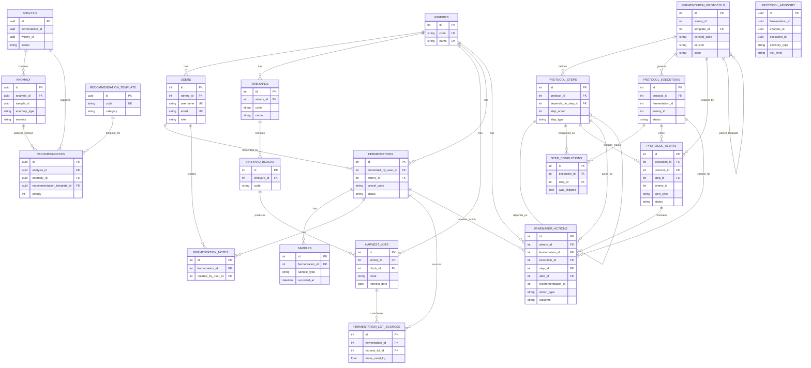

# Entity Relationship Diagram (Database)

This ER diagram is derived from the Alembic migrations in `alembic/versions/`.

## Full Relational ERD

## Notes on Intentional Non-FK Links

Some references are intentionally stored without foreign key constraints to keep module boundaries independent (for example, analysis/protocol cross-module identifiers).

Important examples:

- `analysis.fermentation_id`, `analysis.winery_id`
- `anomaly.sample_id`
- `protocol_executions.fermentation_id`, `protocol_executions.winery_id`
- `protocol_advisory.fermentation_id`, `protocol_advisory.analysis_id`, `protocol_advisory.execution_id`
- `winemaker_actions.recommendation_id`
