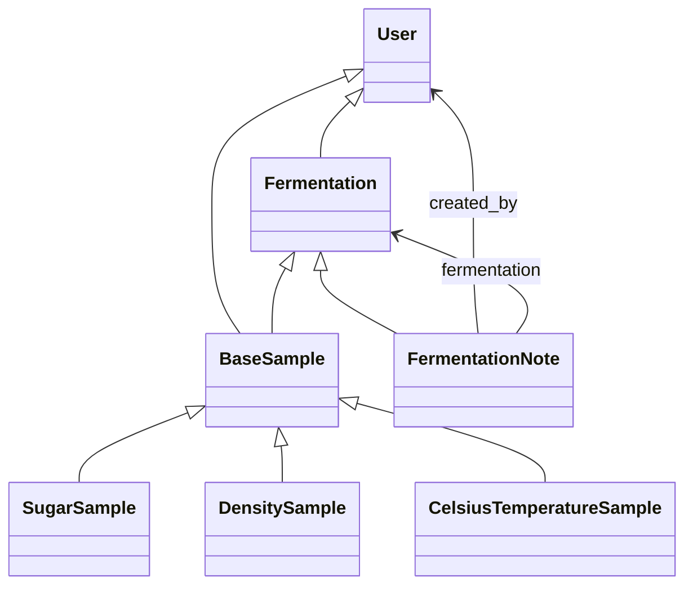

# Wine Fermentation Domain Model Guide

---

## 1. Ubiquitous Language Glossary

| Business Concept         | Code / Entity                   | Technical Definition                                                                              |
|-------------------------|----------------------------------|---------------------------------------------------------------------------------------------------|
| Fermentation            | `Fermentation`                   | Process of converting sugars into alcohol and CO₂ by yeast action.                                |
| Sugar Sample            | `SugarSample`                    | Point measurement of sugar concentration (°Brix) in must/wine.                                   |
| Temperature Sample      | `CelsiusTemperatureSample`       | Point measurement of temperature (°C) during fermentation.                                       |
| Density Sample          | `DensitySample`                  | Point measurement of density (specific gravity) of must/wine.                                    |
| User                    | `User`                           | Oenologist or system user, responsible for recording data and managing fermentations.            |
| Fermentation Note       | `FermentationNote`               | Observation or action taken during the process, associated with a fermentation.                  |
| Fermentation Status     | `FermentationStatus` (enum)      | Process state: ACTIVE, COMPLETED, DECLINE, LAG, STUCK, SLOW.                                    |
| Sample Type             | `SampleType` (enum)              | Classification: SUGAR, TEMPERATURE, DENSITY.                                                     |
| Sample (base)           | `BaseSample`                     | Polymorphic base class for all samples.                                                          |

---

## 2. Domain Entities Map

### Main Entities

- **Fermentation**
  - Responsibility: Represents a fermentation process of a wine batch.
  - Relationships: Has many `Sample` and many `FermentationNote`. Belongs to a `User` (oenologist).
  - States: `status` (`FermentationStatus`), start dates, initial parameters.
  - Rules: No samples can exist before the start date. Only one responsible user.

- **User**
  - Responsibility: Represents a user/oenologist.
  - Relationships: Can have many `Fermentation` and record many `Sample`.
  - Rules: Authentication, winery membership (`winery_id`).

- **FermentationNote**
  - Responsibility: Documents actions/observations during fermentation.
  - Relationships: Belongs to a `Fermentation` and a `User`.

- **Sample (BaseSample, SugarSample, DensitySample, CelsiusTemperatureSample)**
  - Responsibility: Point measurement of a relevant parameter.
  - Relationships: Belongs to a `Fermentation` and a `User` (who recorded it).
  - Polymorphism: `BaseSample` is the root, subclasses define type and units.
  - Rules: Unique timestamp per type and fermentation, soft delete (`is_deleted`).

#### Relationship Diagram (Mermaid)



---

## 3. Value Objects Catalog

Currently **no explicit value objects have been identified** in the code. It is recommended to:
- Extract value objects for concepts like `Brix`, `SpecificGravity`, `TemperatureCelsius` to encapsulate validation and comparison logic.
- Suggested value object example:

```python
class Brix:
    def __init__(self, value: float):
        if not (0 <= value <= 40):
            raise ValueError("Brix out of valid range")
        self.value = value
    def __eq__(self, other):
        return isinstance(other, Brix) and self.value == other.value
```

---

## 4. Aggregates and Boundaries

- **Aggregate Root:** `Fermentation`
  - All samples and notes must be accessed/modified through the fermentation aggregate.
  - Consistency: Samples cannot be recorded for non-existent or finished fermentations.
  - Access: Repositories (`ISampleRepository`, `IFermentationRepository`) must respect aggregate boundaries.

---

## 5. Domain Events

No explicit domain events have been found in the code. It is recommended to:
- Define events such as `SampleAdded`, `FermentationCompleted` to decouple business logic and side effects.
- Suggested example:

```python
class SampleAdded:
    def __init__(self, sample_id: int, fermentation_id: int):
        self.sample_id = sample_id
        self.fermentation_id = fermentation_id
```

---

## 6. Business Invariants

- **There cannot be samples with duplicate timestamp per type and fermentation.**
- **Samples cannot be recorded before the fermentation start date.**
- **Only active and verified users can record data.**
- **A fermentation can only be in a valid state (`FermentationStatus`).**
- **Soft delete:** Samples are not physically deleted, only marked (`is_deleted`).
- **Unit consistency:** Each sample subclass defines its units and validations.

---

## 7. Cross References

- [Repository Implementation Guide](repository-implementation-guide.md)
- Interfaces: `ISampleRepository`, `IFermentationRepository`
- Enums: `SampleType`, `FermentationStatus`
- Entities: `Fermentation`, `BaseSample`, `SugarSample`, `DensitySample`, `CelsiusTemperatureSample`, `FermentationNote`, `User`

---

> **Note:** This guide should be kept up to date as the domain model evolves and value objects and domain events are implemented.
