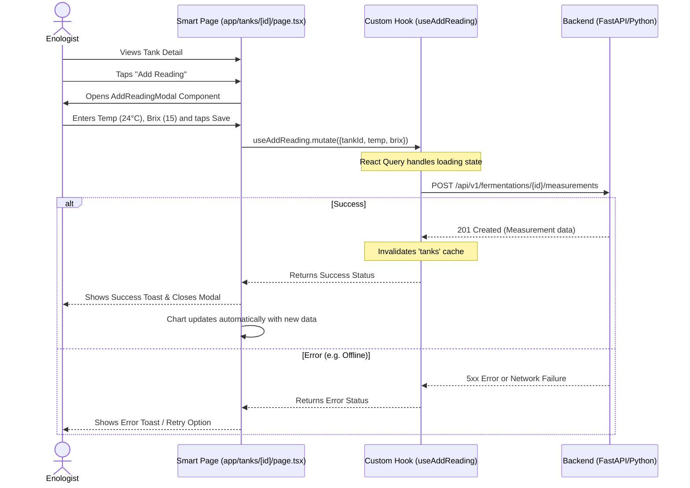

# Frontend Implementation Workflow (Component-Driven)

This document outlines the strict, step-by-step process for building the Wine Fermentation System frontend. It ensures that humans and AI agents build the UI in a structured, maintainable, and predictable way.

## 1. Actors & Use Cases
- **Enologist / Technician (Mobile First)**: Needs fast data entry on the cellar floor. Poor Wi-Fi. Needs immediate visual cues (red/green) to spot problem tanks.
- **Admin / Owner / Lead Enologist (Desktop)**: Needs deep analysis, historical comparisons across vintages, user management, and configuration.

### Sequence Diagram: Enologist adding a reading

## 2. The 5-Step Implementation Process

Never build an entire page from scratch in one go. Follow this atomic process for every new feature.

### Step 1: Design (The Mockup Phase)
- Define exactly what data is needed on the page.
- Draw a mockup, wireframe, or write a bulleted list of visual elements.
- **Goal:** Know what you are building before writing code.

### Step 2: Deconstruction (The Inventory)
- Break down the mockup into atomic components.
- Examples: `<StatusBadge>`, `<ThermometerIcon>`, `<DataCard>`, `<FermentationChart>`.
- Check if any component already exists in `components/ui/` (e.g., standard buttons).

### Step 3: Logic Extraction (The Controllers)
- Write the TypeScript interfaces in `models/`.
- Write pure business logic in `utils/` (e.g., calculating alcohol percentage).
- Write the API call and data-fetching logic inside a Custom Hook in `hooks/` using TanStack Query.
- **Goal:** Have the data ready and tested without rendering any UI.

### Step 4: Build Presentational Atoms (The Views)
- Create isolated React components in `components/`.
- These components must be "dumb": they only receive `props` and render HTML/Tailwind. They DO NOT call the API or use Hooks directly.
- **Goal:** Build the visual Lego blocks.

### Step 5: Assembly (The Smart Page)
- Create the route in the `app/` directory (e.g., `app/tanks/page.tsx`).
- Call the Custom Hook (from Step 3) to get the data.
- Pass the data as props to the Presentational Components (from Step 4).
- **Goal:** The page acts as the "glue" between logic and presentation.

---

> **Note for AI Agents:** When asked to create a new page, ALWAYS start by outlining the steps according to this workflow. Wait for user confirmation on Step 1 (Design) before generating the code for Steps 3, 4, and 5.
